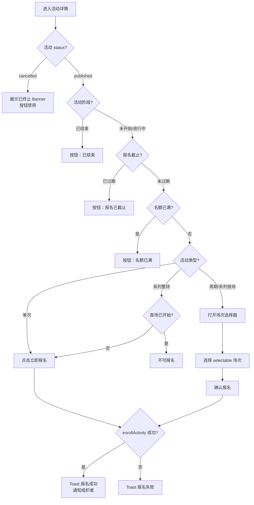
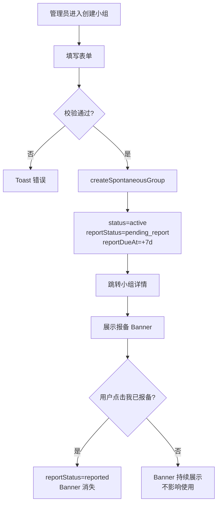
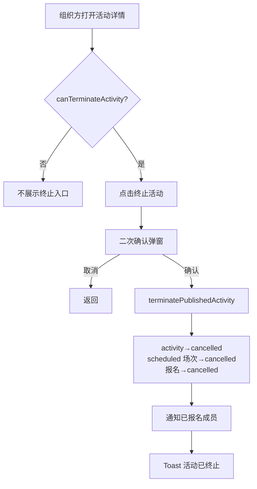
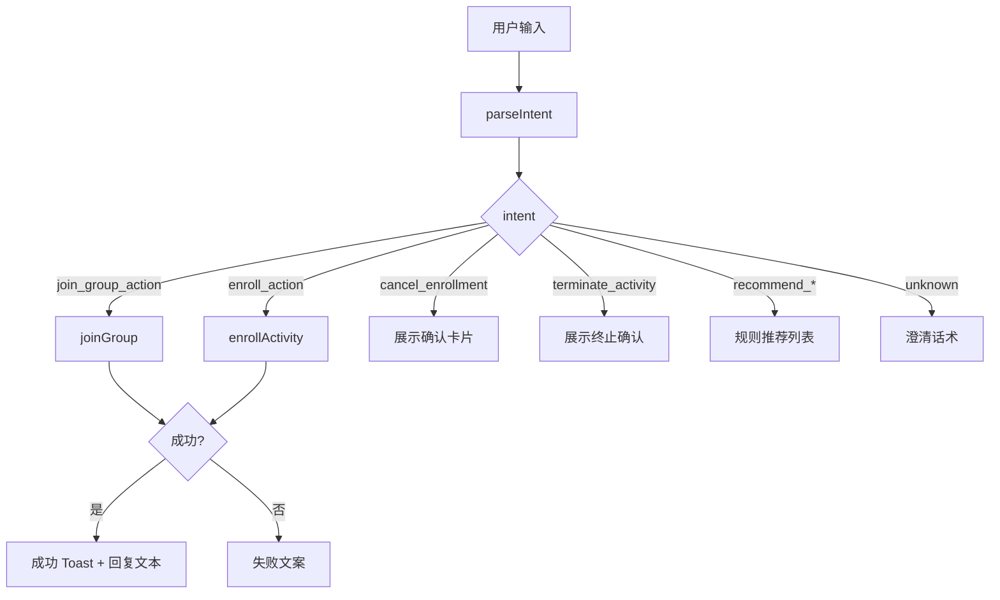

# EXP 兴趣小组产品需求文档（PRD）

> **文档说明**：本文档完全基于项目源代码逆向分析生成，反映当前已实现的产品行为。  
> **版本**：v1.0（代码快照：2026-06-03）  
> **适用范围**：C 端移动端兴趣小组模块（含 AI 助手、管理侧移动列表），不含独立 PC 管理后台实现。

---

## 1. 项目背景、业务目的、量化业务指标

### 1.1 项目背景

EXP 智能体是企业内部 AI 工作助手。兴趣小组模块嵌入「更多智能体」入口，为员工提供基于共同兴趣的社交与活动组织场景：发现小组、报名活动、自发建组、小组圈互动、活动精彩瞬间沉淀，并通过规则引擎 AI 助手降低查找与操作成本。

当前为**前端原型**：数据存于内存与浏览器本地存储，无独立后端服务；登录用户固定为演示账号（张敏，员工 ID：`u1`）。

### 1.2 业务目的

| 目的 | 产品价值 |
|------|----------|
| 提升员工非工作场景连接 | 通过小组与活动降低「找同类、约活动」成本 |
| 降低活动组织门槛 | 管理员身份可快速建组、发活动；单次/周期/系列三种形态覆盖常见场景 |
| 活动参与与小组加入解耦 | 员工可直接报名活动，无需先加入小组 |
| 自发组合规提醒 | 创建即上线，7 日内引导完成工会/HR 报备，不阻断使用 |
| AI 辅助决策 | 规则引擎理解自然语言，推荐小组/活动并支持对话内加入、报名、取消 |

### 1.3 量化业务指标

> 以下指标为基于产品能力推导的**可观测指标**；代码中未内置埋点，需在正式环境接入统计后验证基线。

| 指标 | 定义 | 目标方向 | 统计周期 |
|------|------|----------|----------|
| 小组加入转化率 | 小组详情/推荐曝光 → 成功加入 | ≥ 15% | 月 |
| 活动报名转化率 | 活动详情曝光 → 成功报名 | ≥ 25% | 月 |
| 自发组 7 日报备率 | 创建后 7 日内点击「我已报备」/ 全部自发组 | ≥ 80% | 月 |
| 活动零报名占比 | 即将开始且报名数为 0 的活动 / 全部已发布活动 | ≤ 20% | 周 |
| AI 助手任务完成率 | 对话内触发加入/报名/取消且成功 / 同类意图总数 | ≥ 60% | 月 |
| 管理员待办处理率 | 待报备、零报名待办被点击并处理 / 待办展示次数 | ≥ 50% | 周 |
| 活动准时参与感知 | 开场前 1 小时通知触达后进入活动详情 UV / 通知 UV | ≥ 40% | 月 |

**员工端核心漏斗**：[assumption] 首页/广场曝光 → 详情页 → 加入/报名 → 活动参与反馈（评论/精彩瞬间浏览）。

**管理员端核心漏斗**：切换管理员身份 → 创建小组/发布活动 → 收到报名/成员通知 → 上传精彩瞬间。

---

## 2. 目标用户画像与使用场景

### 2.1 用户角色

系统存在两层身份，**互不替代**：

| 角色 | 切换方式 | 核心诉求 |
|------|----------|----------|
| **员工**（默认） | 首页右上角「员工」 | 发现活动、报名参与、社交互动（评论/点赞/小组圈） |
| **管理员**（演示用身份切换） | 首页右上角「管理员」 | 创建小组、发布/编辑/终止活动、管理列表、上传精彩瞬间；**不可**发评论、点赞 |

> 说明：「管理员」为原型内的应用级身份（`employee` / `manager`），与小组内 `owner`/`member` _membership 角色不同。小组 `owner` 由创建自发组时自动赋予；正式产品需与企业权限体系对齐。

| 小组内角色 | 赋予方式 | 能力 |
|------------|----------|------|
| owner | 创建自发组 / 官方组种子数据 | 编辑小组、解散小组、发布活动（MVP 与管理员身份叠加） |
| admin | 类型已定义 | **当前未使用** |
| member | 加入小组 | 浏览、小组圈发帖、退出小组 |

### 2.2 用户画像

**画像 A：活动参与者（员工）**  
- 28 岁，产品岗，工作日晚上/周末有空  
- 动机：通过羽毛球、跑步等活动认识同事，不想先「入群」再报名  
- 痛点：活动分散、不知道报哪个、怕错过报名截止  

**画像 B：兴趣组长（管理员身份）**  
- 32 岁，部门骨干，兼任兴趣小组组织者  
- 动机：低门槛发起徒步社、读书活动，掌握报名情况  
- 痛点：周期活动排期复杂、有人报名后不敢改时间  

**画像 C：平台运营（管理员身份 + 官方组）**  
- HR/工会接口人  
- 动机：掌握自发组报备状态、活动举办情况  
- 痛点：零报名活动无人跟进  

### 2.3 典型使用场景

| 编号 | 场景 | 用户 | 路径 |
|------|------|------|------|
| S1 | 浏览近期活动并报名 | 员工 | 首页 → 活动广场 → 活动详情 → 立即报名 |
| S2 | AI 推荐小组并加入 | 员工 | 首页 AI 输入「推荐跑步小组」→ 卡片加入 |
| S3 | 创建自发组并发布首场活动 | 管理员 | 创建小组 → 小组详情 → 发布活动 |
| S4 | 系列分享会按场报名 | 员工 | 活动详情 → 选择场次 → 确认报名 |
| S5 | 处理报备提醒 | 管理员 | 小组详情 Banner → 我已报备 |
| S6 | 终止有误活动 | 管理员 | 活动详情 → 终止活动 → 确认 |
| S7 | 活动结束上传精彩瞬间 | 管理员 | 小组详情 → 精彩瞬间 → 选已结束场次 → 上传图片 |
| S8 | 退出小组并取消组内报名 | 员工 | 小组详情 → 退出 → 确认 |

---

## 3. 需求范围（MoSCoW）

### 3.1 Must Have（已实现）

- 兴趣小组首页（员工 feed / 管理员统计）
- 小组广场、活动广场、我的小组、我的活动列表
- 小组详情（活动 / 小组圈 / 精彩瞬间三 Tab）
- 自发组创建、编辑、解散；官方组浏览
- 活动发布（单次 / 周期 / 系列）、编辑、终止
- 报名 / 取消报名（含多场次选择器）
- 报名截止规则（不限制 / 固定时间 / 开始前 N 小时）
- 小组加入 / 退出；满员限制（100 人）
- 活动评论、回复、点赞；小组圈动态
- 小组/活动点赞
- 精彩瞬间（按场次、每场次一条）
- 自发组报备 Banner
- AI 对话助手（规则引擎 + 卡片操作）
- 沟通引擎通知（发布、报名、开场提醒、结束反馈、终止、入组、解散）
- 管理员移动管理列表（小组管理 / 活动管理）
- 身份切换（员工 / 管理员）

### 3.2 Should Have（部分实现或弱实现）

- 部门可见小组（`dept_only` 类型已支持，种子数据少）
- 邀请制小组（类型与拦截文案已有，种子数据无）
- 小组简介 AI 生成、活动介绍 AI 生成（Mock 规则文案，非真实大模型）
- 首页推荐「换一批」偏移刷新
- 管理员首页待办（待报备、零报名活动）

### 3.3 Could Have（类型/规划存在，未完整实现）

- 小组 `admin` 成员角色
- 报备状态 `flagged` 及运营下架
- 活动 `draft` 草稿态
- 员工个人兴趣标签维护页（`interestProfileStore` 已移除）
- 独立 PC Ant Design 管理后台（`/admin/interest-groups/*` 路由不存在）
- 积分/荣誉卡发放（本模块明确不做，由荣誉引擎负责）

### 3.4 Won't Have（本期明确不做）

- 向量检索 / 真实 LLM 对话
- 后端 REST API 与数据库持久化（当前原型）
- 支付、签到核销、直播
- 小组内即时通讯（除小组圈异步动态外）
- 运营后台批量审核、自动下架未报备小组
- 生产级埋点 SDK 接入（代码零实现）

---

## 4. 产品名词、业务术语统一注释

| 术语 | 定义 |
|------|------|
| 兴趣小组 | 以共同兴趣聚合员工的组织单元，分官方组（`official`）与自发组（`spontaneous`） |
| 自发组 | 管理员身份用户创建的小组，创建即 `active`，需 7 日内完成报备 |
| 官方组 | 平台预置小组，无报备流程 |
| 活动 | 小组下可报名的具体事项，分单次 / 周期 / 系列 |
| 场次（Occurrence） | 活动的具体发生时间片；周期活动按规则展开，系列活动按录入的多场生成 |
| 报名 | 员工对活动（或某场次）的参与登记；**不要求**先加入小组 |
| 加入小组 | 成为小组成员，与报名独立 |
| 整场报名 | 系列活动模式：首场开始前报一次，参与全部场次 |
| 按场次报名 | 系列活动默认模式：每场单独报名 |
| 报名截止 | 不限制 / 指定 datetime / 开始前 N 小时（N 为整数，最大 720） |
| 活动阶段 | 未开始 / 进行中 / 已结束（由当前时间与场次时间计算） |
| 活动终止 | 创建人将已发布活动置为 `cancelled`，未举办场次取消，报名作废 |
| 小组解散 | 小组 `archived`，组内全部已发布活动联动终止 |
| 报备 | 自发组上线后 7 日内完成工会/HR 流程确认，仅状态记录，不阻断使用 |
| 精彩瞬间 | 管理员针对**已结束场次**上传的图片记录，每场次最多一条 |
| 小组圈 | 小组成员发布的图文动态，支持回复 |
| 沟通引擎通知 | 写入本地通知中心的业务消息，可从 `/manager/communication-engine` 查看 |
| 应用身份 | 员工 / 管理员切换，控制能否建组、发活动、评论等 |
| 推荐 | 规则打分排序，非个性化向量推荐 |

---

## 5. 全模块通用全局规则

### 5.1 身份与权限

| 规则编号 | 规则描述 | 验收标准 |
|----------|----------|----------|
| G-01 | 默认身份为员工 | 首次进入或未存储时，身份为员工 |
| G-02 | 管理员可查看全部小组，含 archived（员工仅 owner 可看 archived） | 管理员进入已解散小组可见详情；员工非 owner 见「无法查看该小组」 |
| G-03 | 管理员不可发活动评论、不可点赞小组/活动/评论 | 管理员身份下评论入口与点赞按钮不可用或隐藏 |
| G-04 | 管理员可执行建组、发活动、编辑、终止、解散、上传精彩瞬间 | 切换管理员后相关入口可用 |
| G-05 | 非管理员访问需管理员权限的页面时，展示门禁页 | 文案含「仅管理员身份可{操作}」「请在兴趣小组首页右上角切换为「管理员」后再试」 |
| G-06 | AI 对话页仅员工可访问 | 管理员访问 `/agents/interest-groups/chat` 自动重定向首页 |

### 5.2 可见性

| visibility | 员工可见条件 |
|------------|--------------|
| `public` | 所有人可见 |
| `dept_only` | `deptIds` 为空则全员可见；否则仅部门 ID 在列表内员工可见 |
| `invite_only` | 仅成员可见；非成员点击加入提示「邀请制小组，请联系组长」 |

### 5.3 容量与数量限制

| 项目 | 限制 |
|------|------|
| 小组成员 | 100 人（`GROUP_MEMBER_LIMIT`） |
| 小组标签 | 最多 3 个 |
| 自定义标签 | 1–6 个汉字 |
| 评论/动态图片 | 最多 9 张/条 |
| 单张图片 | ≤ 5MB，须为图片类型 |
| 评论文字 | 最多 500 字 |
| 多场次报名选择器展示 | 最多 10 个 upcoming 场次 |
| 周期活动预生成场次 | 4 场 |
| AI 卡片列表预览 | 最多 3 条，超出显示「查看更多」 |

### 5.4 时间与状态

| 规则 | 说明 |
|------|------|
| 报名截止须早于活动参考开始时间 | 参考开始时间：单次=活动开始；系列=最早场次；周期=下一场规则时间 |
| 报名即将截止 | 距截止 ≤ 4 小时且未过期，展示「报名即将截止」 |
| 周期/系列 terminated | 活动 `cancelled`，scheduled 场次→`cancelled`，报名→`cancelled` |
| 退出小组 | 自动取消该员工在本组所有活动的报名 |
| 组长不可退出 | 仅可解散；普通成员可退出 |

### 5.5 数据与通知

| 规则 | 说明 |
|------|------|
| 发布活动 | 创建人自动报名（跳过截止与名额限制），不发「有人报名」通知给自己 |
| 沟通引擎 | 入组、解散、终止、发布、报名、开场前约 1 小时、结束后反馈 |
| 去重 | 开场提醒、结束反馈按活动+用户维度本地去重 |

---

## 6. 分模块详细产品需求

### 6.1 兴趣小组首页

**路由**：`/agents/interest-groups`

#### 前置条件
- 用户已进入 EXP 智能体体系（原型为固定用户 u1）

#### 正常流程

**员工身份**
1. 展示快捷入口：活动广场、小组广场、我的活动、我的小组
2. Feed Tab：近期活动（默认）/ 小组推荐
3. 近期活动：取 2 条预览；小组推荐：规则推荐 5 条，支持「换一批」
4. 底部 AI 话题 chips + 输入框，跳转对话页并携带 `?q=` 自动发送
5. 进入时触发沟通引擎定时检查（开场提醒、结束反馈）

**管理员身份**
1. 快捷入口：小组管理、活动管理、创建小组
2. 展示统计卡片（本周/近30天/近90天）：发布活动数、场次数、报名数；待办：待报备小组数、零报名活动数
3. 不展示 Feed Tab 与 AI 底部栏

#### 全场景异常

| 场景 | 处理 |
|------|------|
| 推荐小组加入时已满 | Toast「小组已满」 |
| 加入成功 | Toast「已加入「{小组名}」」 |

#### 交互说明
- 左上角返回上一级或 fallback 首页
- 右上角 `RoleIdentitySwitcher` 切换员工/管理员
- 员工 Feed Tab 状态同步 URL 参数 `feed=activities|groups`

#### 验收标准
- [ ] 员工默认见 4 个快捷入口 + AI 区；管理员见 3 个入口 + 统计区，无 AI 区
- [ ] 换一批后推荐列表 offset 变化，不重复同一批（在候选足够时）
- [ ] 统计周期切换后三项数值随周期变化
- [ ] 有待报备自发组时，管理员待办展示「N 个小组待报备」并可跳转小组管理

---

### 6.2 AI 对话助手

**路由**：`/agents/interest-groups/chat`

#### 前置条件
- 身份为员工

#### 正常流程
1. 展示对话气泡 + 嵌入小组/活动卡片
2. 用户输入自然语言，系统解析意图并回复文本 + 卡片 + 建议追问
3. 支持卡片内操作：加入小组、报名、确认取消报名、确认终止活动
4. 支持 URL `?q=` 预填并自动发送
5. 首页建议问题：「如何加入兴趣小组？」「这周有什么活动？」「推荐适合我的小组」（不含「怎么发起一个活动？」）

#### 意图识别规则（关键词摘要）

| 意图 | 触发示例 |
|------|----------|
| 推荐小组 | 推荐、有没有、想加入、找XX组、随便推荐 |
| 推荐/列出活动 | 这周/下周有什么活动、推荐活动 |
| 小组详情 | 匹配到小组名 + 介绍/干什么 |
| 活动详情 | 活动时间/地点/在哪 |
| 加入小组 | 小组名 + 加入 |
| 报名 | 帮我报名、报名第一个 |
| 取消报名 | 取消报名、不去了 |
| 终止活动 | 终止/下架活动（不含「报名」） |
| 修改活动 | 改活动时间/地点 |
| 创建引导 | 创建/发起小组或活动 |
| 我的小组 | 我加入了、我的小组 |

#### 全场景异常

| 场景 | 用户可见结果 |
|------|--------------|
| 无法理解 | 澄清话术 + 建议问题列表 |
| 加入失败 | 「小组已满或无法加入」 |
| 报名失败 | 「报名失败，可能已满或已截止」 |
| 终止失败 | Toast「终止失败，请稍后再试」 |
| 取消失败 | Toast「取消失败，请稍后再试」 |
| 管理员在对话中尝试创建/操作 | 「请切换为管理员身份后再…」 |
| 输入「保留报名」 | 助手确认保留当前报名 |
| 输入「保留活动」 | 助手确认活动继续保留 |

#### 验收标准
- [ ] 管理员访问自动跳转首页
- [ ] 「这周有什么活动」返回 ≤3 张活动卡片，超出有「前往活动广场」
- [ ] 「推荐跑步小组」优先匹配跑步相关标签/名称
- [ ] 对话内报名成功后 Toast「已报名「…」」
- [ ] 卡片最多展示 3 条，total>3 时出现查看更多链接

---

### 6.3 小组广场

**路由**：`/agents/interest-groups/discover`

#### 正常流程
1. 展示「推荐」Tab（唯一 Tab）
2. 无搜索时展示 AI 推荐小组列表 + 换一批
3. 搜索框匹配小组名称、分类、简介、标签名
4. 点击卡片进详情；可一键加入

#### 异常

| 场景 | 处理 |
|------|------|
| 搜索无结果 | 文案「未找到相关小组」 |
| 已满 | Toast「小组已满」 |

#### 验收标准
- [ ] 搜索「徒步」可匹配名称或标签含徒步的小组
- [ ] 已加入的小组不出现在推荐候选中

---

### 6.4 活动广场 / 列表分区

**路由**：`/agents/interest-groups/list/:section`  
**section**：`recent` | `my-groups` | `recommend`

#### 6.4.1 近期活动（recent）

- 数据源：已发布、所属小组可见、存在未结束场次的活动；**同一 activityId 仅一条**
- 时间展示：单次=起止时间；周期=规则摘要；系列=场次数+下一场时间
- 员工：支持搜索（标题、简介、地点、组名）；日期筛选（全部/今天/本周/本月，周一起算）
- 管理员：无搜索栏；展示「报名即将截止」标签（4 小时内）
- 空态：「暂无即将开始的活动」/「该时段暂无活动」/「未找到相关活动」

#### 6.4.2 我的小组（my-groups）

- 员工：仅「我加入的」Tab
- 管理员：「我创建的」「我加入的」双 Tab + 标签分类筛选
- 空态：「还没有加入小组」/「还没有创建小组」/「该标签分类下暂无小组」

#### 6.4.3 小组推荐（recommend）

- 规则推荐列表，可加入
- 空态：「暂无推荐小组」

#### 验收标准
- [ ] 已结束且无 upcoming 场次的活动不在 recent 列表
- [ ] 员工 my-groups 不出现「我创建的」Tab
- [ ] 无效 section 参数回退为 recent

---

### 6.5 我的活动

**路由**：`/agents/interest-groups/my-activities?role=&phase=`

#### 正常流程
- **员工**：仅「我报名的场次」
- **管理员**：Tab「我发布的」/「我报名的场次」
- 阶段筛选：全部 / 未开始 / 进行中 / 已结束 / 已终止
- 点击已报名场次进入活动详情并带 `occurrenceId`

#### 空态文案
- 我发布的：「还没有发布任何活动」/「暂无已终止的活动」/「该状态下暂无活动」
- 我报名的：「还没有报名任何场次」/「暂无已终止的场次」/「该状态下暂无场次」

#### 验收标准
- [ ] 员工 URL 强行 `role=organized` 时被 clamp 为 participated
- [ ] 已终止活动仅在「已终止」筛选出现

---

### 6.6 管理列表

**路由**：`/agents/interest-groups/admin/:kind`（`groups` | `activities`）

#### 前置条件
- 管理员身份（否则 InterestRoleGate）

#### 正常流程
- **小组管理**：全部 active 小组；标签分类筛选；搜索
- **活动管理**：管理员视角近期活动；日期筛选；搜索

#### 验收标准
- [ ] 非管理员见门禁页，按钮返回
- [ ] 无效 kind 默认 groups

---

### 6.7 创建小组

**路由**：`/agents/interest-groups/new`

#### 表单字段

| 字段 | 必填 | 规则 |
|------|------|------|
| 小组封面 | 是 | 图片 ≤5MB |
| 小组头像 | 否 | 方图，同上 |
| 小组名称 | 是 | 非空 trim |
| 标签 | 是 | 1–3 个 |
| 简介 | 否 | 空则默认「欢迎加入我们的兴趣小组！」 |

#### 正常流程
1. 校验通过 → 创建自发组
2. 属性：`type=spontaneous`, `visibility=public`, `status=active`, `reportStatus=pending_report`, `reportDueAt=创建日+7天`, `memberCount=1`, 创建人为 owner
3. Toast「小组已创建」→ 跳转小组详情

#### 异常

| 校验失败 | Toast |
|----------|-------|
| 无名称 | 请填写小组名称 |
| 无标签 | 请至少选择一个标签 |
| 标签>3 | 最多选择 3 个标签 |
| 无封面 | 请上传小组封面 |

#### 验收标准
- [ ] 创建后详情页顶部出现报备 Banner
- [ ] 创建人自动为 owner 且成员数 1
- [ ] 非管理员无法进入创建页

---

### 6.8 小组详情

**路由**：`/agents/interest-groups/:groupId?panel=&kind=`

#### 正常流程
1. Header：封面、名称、标签、成员数、简介
2. 自发组且 `reportStatus=pending_report`：报备 Banner
3. 员工：点赞；非成员且未满可加入；成员且非 organizer 可退出
4. 管理员/organizer：编辑、解散、发布活动
5. Tab：活动（可按单次/周期/系列筛选）/ 小组圈 / 精彩瞬间
6. 小组圈：成员且员工身份可底部发帖

#### 异常

| 场景 | 处理 |
|------|------|
| 无查看权限 | 「无法查看该小组」 |
| archived | 「小组已解散」，隐藏互动区 |
| invite_only 非成员加入 | Toast「邀请制小组，请联系组长」 |
| 已满 | 按钮禁用，「小组已满员」 |
| 退出确认 | 文案含将取消组内活动报名 |
| 退出失败 | Toast「退出失败，请稍后重试」 |
| 解散 | 确认后组 archived，终止组内全部已发布活动，Toast 含终止活动数 |
| 报备 | 点击「我已报备」→ `reportStatus=reported`，Banner 消失 |

#### 验收标准
- [ ] 组长无退出按钮，有解散入口
- [ ] 解散后活动列表状态为已终止
- [ ] 员工可点赞，管理员不可

---

### 6.9 编辑小组

**路由**：`/agents/interest-groups/:groupId/edit`

#### 可编辑字段
名称（必填）、封面、标签（≤3）、简介

#### 异常
- 不可编辑：「无法编辑该小组」（非 active 或无 organize 权限）
- 保存失败：「保存失败，请稍后重试」

#### 验收标准
- [ ] 保存成功 Toast「已保存」并返回

---

### 6.10 发布活动

**路由**：`/agents/interest-groups/:groupId/activities/new`

#### 公共字段

| 字段 | 必填 | 默认值 | 校验 |
|------|------|--------|------|
| 活动类型 | 是 | 单次 | 单次/周期/系列互斥字段 |
| 活动名称 | 是 | — | 非空 |
| 活动介绍 | 是 | — | 非空 |
| 活动地点 | 是 | — | 非空 |
| 人数上限 | 是 | 单次/周期 20；选系列时若仍为 20 则自动改 50 | 整数 ≥1 |
| 活动封面 | 是 | — | 图片 |
| 报名截止 | 否 | 不限制 | 见 5.4 |

#### 单次活动额外字段
- 日期 + 开始/结束时段；结束须晚于开始

#### 周期活动额外字段
- 重复：每周 / 每月
- 每周：选周几 + 时段
- 每月：选日期 + 时段
- 发布后生成 4 个 upcoming 场次

#### 系列活动额外字段
- 报名方式：按场次报名（默认）/ 整场报名
- 至少 1 个场次，每场日期+时段，结束>开始
- 场次按开始时间排序写入

#### 正常流程
1. 校验通过 → `status=published`
2. 单次活动：发布者自动报名
3. 周期/系列：为各场次执行组织者自动报名逻辑
4. Toast「活动已发布」→ 回小组详情

#### 验收标准
- [ ] 三种类型切换时表单项正确显隐
- [ ] 系列默认容量 50（从 20 切换系列时）
- [ ] 报名截止为「开始前 24 小时」时，存储 mode=hours_before_start

---

### 6.11 活动详情

**路由**：`/agents/interest-groups/activities/:activityId?edit=1&occurrenceId=`

#### 参与方正常流程
1. 查看活动信息、场次列表、评论（最新/最热）
2. 员工可点赞、发评论（文字+图）、回复
3. 报名：单次直接报；周期/系列按场打开场次选择器
4. 系列整场模式：首场前报一次，按钮「已报名系列活动」
5. 取消报名：单次/整场一次确认；多场可选择取消哪些场次

#### 组织方正常流程
1. 编辑（`?edit=1` 或编辑按钮）
2. 查看报名名单（按场次）
3. 终止活动（见 6.12）

#### 底部按钮状态

| 条件 | 按钮文案/状态 |
|------|---------------|
| 可报名 | 立即报名 |
| 已报名 | 取消报名 / 已报名系列活动 |
| 已终止 | 活动已终止（禁用） |
| 已过截止 | 报名已截止 |
| 已满 | 名额已满 |
| 已结束 | 已结束 |

#### 异常 Toast 汇总

| 场景 | 文案 |
|------|------|
| 活动不存在 | 页面「活动不存在」 |
| 已终止时报名 | 活动已终止 |
| 已结束 | 活动已结束 |
| 过截止 | 已过报名截止时间 |
| 系列整场已开始 | 首场已开始，本系列活动不再接受新报名 |
| 报名失败 | 报名失败，请稍后重试 |
| 取消失败 | 取消失败 |
| 未选场次 | 请至少选择一个场次 / 请至少选择一个要取消的场次 |

#### 验收标准
- [ ] 未加入小组的用户可成功报名
- [ ] 终止后 Banner「本活动已由创建人终止…」
- [ ] 进行中/已结束默认隐藏底部报名栏（已终止例外展示说明）
- [ ] 管理员无评论输入框

---

### 6.12 编辑 / 终止活动

**编辑路由**：`/agents/interest-groups/activities/:activityId/edit` → 重定向 `?edit=1`

#### 编辑规则
- 可改：名称、介绍、地点、人数、封面、截止、时间/场次（**无他人报名时**）
- **已有其他用户报名**：时间、场次、报名方式锁定；Banner「已有其他用户报名，不可修改…」
- 保存成功：「活动信息已更新」

#### 终止规则

| 活动类型 | 可终止条件 |
|----------|------------|
| 周期 / 系列 | 已发布即可 |
| 单次 | 已发布且存在**除创建人外**的报名 |

#### 终止效果
- 活动 `cancelled`；scheduled 场次→`cancelled`；全部报名→`cancelled`
- 通知已报名成员
- Toast「活动已终止，未举办场次已取消」

#### 验收标准
- [ ] 单次仅创建人报名时不显示终止按钮
- [ ] 终止后不可再报名
- [ ] 有他人报名时编辑页 schedule 字段 disabled

---

### 6.13 活动评论

#### 规则
- 顶级评论：文字和/或图片至少一项；图片最多 9 张
- 回复：仅文字，须非空；回复不增加顶级评论计数
- 仅作者可删自己的评论；删除顶级评论同时删回复
- 排序：最新 / 最热（点赞数）

#### 异常
- 空内容：「发布失败…」/ 不提交
- 非作者删除：失败

#### 验收标准
- [ ] 500 字上限 enforced（输入组件）
- [ ] 单图 >5MB 提示「单张图片不能超过 5MB」

---

### 6.14 小组圈

#### 规则
- 仅**小组成员**且**员工身份**可发帖
- 规则同评论：内容或图片至少一项，最多 9 图

#### 验收标准
- [ ] 非成员无底部 composer
- [ ] 管理员浏览但不可发

---

### 6.15 精彩瞬间

#### 规则
- 仅管理员身份可上传/编辑/删除
- 仅**已结束或已完成**场次可选
- **每场次仅一条**；已有则只能编辑，不可重复创建
- 图片至少 1 张；说明可选

#### 异常
- 无可用场次：「暂无可上传的已结束场次」
- 均已上传：「已结束场次均已上传…」
- 重复上传：「该场次已上传精彩瞬间，请编辑已有内容」

#### 验收标准
- [ ] 删除后可重新为该场次上传
- [ ] 详情页组织者可见编辑/删除

---

### 6.16 沟通引擎通知

**入口**：`/manager/communication-engine`

| 类型 | 触发时机 | 预览示例 |
|------|----------|----------|
| activity_published | 活动发布 | 「{组名}」发布了新活动「{标题}」 |
| activity_enrolled | 他人报名 | 「{姓名}报名了「{标题}」，当前共 N 人报名」 |
| activity_starting_soon | 开始前约 1h | 「{标题}」将在 1 小时后开始… |
| activity_ended_feedback | 活动结束后 | 「{标题}」已结束，欢迎留言… |
| activity_terminated | 活动终止 | 「{标题}」活动已终止，报名已作废 |
| member_joined_group | 新成员入组 | 「{姓名}加入了「{组名}」」 |
| group_disbanded | 小组解散 | 「{组名}」已解散… |

#### 验收标准
- [ ] 组织者与同一用户重合时不发入组/报名通知给自己
- [ ] 开场提醒不重复（本地 mark 去重）

---

## 7. 关键业务流程（Mermaid）

### 7.1 活动报名流程

### 7.2 自发组创建与报备

### 7.3 活动终止流程

### 7.4 AI 对话处理流程

---

## 8. 页面字段清单

### 8.1 创建小组

| 字段 | 必填 | 校验 | 枚举/选项 | 默认值 |
|------|------|------|-----------|--------|
| 小组封面 | 是 | 图片类型，≤5MB | — | 无 |
| 小组头像 | 否 | 同上 | — | 无 |
| 小组名称 | 是 | trim 非空 | — | 空 |
| 标签 | 是 | 1–3 个 | 标签目录+自定义 | [] |
| 简介 | 否 | — | — | 空（提交默认文案） |

### 8.2 编辑小组

| 字段 | 必填 | 校验 | 默认值 |
|------|------|------|--------|
| 小组名称 | 是 | trim 非空 | 原值 |
| 封面 | 否 | 图片 | 原值 |
| 标签 | 否 | ≤3 | 原值 |
| 简介 | 否 | — | 原值 |

### 8.3 发布活动（公共）

| 字段 | 必填 | 校验 | 枚举 | 默认值 |
|------|------|------|------|--------|
| 活动类型 | 是 | — | 单次/周期/系列 | 单次 |
| 活动名称 | 是 | 非空 | — | 空 |
| 活动介绍 | 是 | 非空 | — | 空 |
| 活动地点 | 是 | 非空 | — | 空 |
| 人数上限 | 是 | 整数≥1 | — | 20（系列切换 50） |
| 活动封面 | 是 | 图片≤5MB | — | 无 |
| 报名截止模式 | 否 | 见下 | 不限制/固定时间/开始前N小时 | 不限制 |
| 固定截止时间 | 条件 | 早于活动开始 | datetime | 空 |
| 开始前小时数 | 条件 | 正整数，≤720 | 快捷 2/8/12/24 | 24 |

### 8.4 单次活动日程

| 字段 | 必填 | 校验 |
|------|------|------|
| 日期 | 是 | — |
| 开始时间 | 是 | 结束>开始 |
| 结束时间 | 是 | 同日 |

### 8.5 周期活动

| 字段 | 必填 | 枚举 |
|------|------|------|
| 重复频率 | 是 | 每周/每月 |
| 每周几 | 条件 | 周一至周日 |
| 每月几号 | 条件 | 1–31 |
| 开始/结束时刻 | 是 | HH:mm |

### 8.6 系列活动

| 字段 | 必填 | 枚举/说明 |
|------|------|-----------|
| 报名方式 | 是 | 按场次报名 / 整场报名 |
| 场次列表 | 是（≥1） | 每场：日期+开始+结束 |

### 8.7 活动评论 / 小组圈

| 字段 | 必填 | 校验 |
|------|------|------|
| 文字 | 条件 | 与图片至少一项；评论≤500字 |
| 图片 | 条件 | ≤9 张，每张≤5MB |

### 8.8 精彩瞬间

| 字段 | 必填 | 校验 |
|------|------|------|
| 关联场次 | 是 | 已结束且未占用 |
| 图片 | 是 | ≥1 张 |
| 说明 | 否 | — |

### 8.9 URL 参数枚举

| 参数 | 页面 | 允许值 | 默认 |
|------|------|--------|------|
| feed | 首页 | activities, groups | activities |
| section | 列表 | recent, my-groups, recommend | recent |
| range | 活动列表 | all, today, week, month | all |
| role | 我的活动 | organized, participated | participated |
| phase | 我的活动 | 全部, 未开始, 进行中, 已结束, 已终止 | 全部 |
| panel | 小组详情 | activities, moments, highlights | activities |
| kind | 小组详情活动筛选 | one_off, recurring, series | 全部 |
| kind | 管理列表 | groups, activities | groups |
| tagCat | 小组列表 | 标签目录分类 ID | 全部 |

---

## 9. 数据操作清单（产品 API 契约）

> **说明**：当前原型无 HTTP 接口，下表为源代码中**数据操作函数**对应的产品级 API 契约，供后续后端对齐。统一前缀建议 `/api/v1/interest-groups`。

### 9.1 小组

| 操作 | 建议方法 | 建议路径 | 入参 | 返回 | 业务失败 |
|------|----------|----------|------|------|----------|
| 查询小组详情 | GET | `/groups/{groupId}` | — | InterestGroupFull | 404 不存在；403 不可见 |
| 加入小组 | POST | `/groups/{groupId}/join` | employeeId | success, memberCount | GROUP_FULL 已满；INVITE_ONLY 邀请制 |
| 退出小组 | POST | `/groups/{groupId}/leave` | employeeId | success | OWNER_CANNOT_LEAVE；NOT_MEMBER |
| 创建自发组 | POST | `/groups` | name, description, tagIds, coverUrl, avatarUrl?, visibility | group | VALIDATION_ERROR；FORBIDDEN 非管理员 |
| 更新小组 | PATCH | `/groups/{groupId}` | name, description, tagIds, coverUrl | group | FORBIDDEN；GROUP_ARCHIVED |
| 解散小组 | POST | `/groups/{groupId}/disband` | actorId | group, terminatedActivityCount | FORBIDDEN；GROUP_ARCHIVED |
| 标记已报备 | POST | `/groups/{groupId}/report` | — | reportStatus=reported | NOT_SPONTANEOUS |
| 小组成员列表 | GET | `/groups/{groupId}/members` | — | members[] | 403 |

### 9.2 活动

| 操作 | 建议方法 | 建议路径 | 入参 | 返回 | 业务失败 |
|------|----------|----------|------|------|----------|
| 活动详情 | GET | `/activities/{activityId}` | occurrenceId? | activity, occurrences | 404 |
| 发布活动 | POST | `/groups/{groupId}/activities` | 见字段清单 §8 | activity | VALIDATION_ERROR |
| 更新活动 | PATCH | `/activities/{activityId}` | 可编辑字段 | activity | SCHEDULE_LOCKED 有他人报名 |
| 终止活动 | POST | `/activities/{activityId}/terminate` | actorId | activity | CANNOT_TERMINATE；FORBIDDEN |
| 近期活动列表 | GET | `/activities/recent` | range, q, viewerId | items[] | — |
| 报名 | POST | `/activities/{activityId}/enroll` | employeeId, occurrenceId? | enrollment | ENROLL_CLOSED；FULL；ALREADY_ENROLLED |
| 取消报名 | POST | `/activities/{activityId}/cancel-enroll` | employeeId, occurrenceId? | success | NOT_ENROLLED |
| 报名名单 | GET | `/activities/{activityId}/enrollees` | occurrenceId? | enrollees[] | FORBIDDEN |

### 9.3 社交

| 操作 | 建议方法 | 建议路径 | 入参 | 返回 | 业务失败 |
|------|----------|----------|------|------|----------|
| 发评论 | POST | `/activities/{activityId}/comments` | content, imageUrls | comment | EMPTY；FORBIDDEN 管理员 |
| 回复 | POST | `/comments/{id}/replies` | content | reply | PARENT_NOT_FOUND |
| 删评论 | DELETE | `/comments/{id}` | — | success | NOT_AUTHOR |
| 点赞活动 | POST | `/activities/{activityId}/like` | toggle | liked, count | FORBIDDEN |
| 小组圈发帖 | POST | `/groups/{groupId}/moments` | content, imageUrls | moment | NOT_MEMBER |
| 精彩瞬间 CRUD | POST/PATCH/DELETE | `/groups/{groupId}/highlights` | occurrenceId, imageUrls, caption? | highlight | OCCUPATION_EXISTS；NO_ENDED_SESSION |

### 9.4 AI 与推荐

| 操作 | 建议方法 | 建议路径 | 入参 | 返回 |
|------|----------|----------|------|------|
| 解析意图 | POST | `/agent/parse` | message | intent, entities |
| 推荐小组 | GET | `/recommend/groups` | limit, offset, topic? | scoredGroups[] |
| 推荐活动 | GET | `/recommend/activities` | timeFilter, topic? | activities[] |

### 9.5 业务异常码汇总

| 码 | 含义 | 用户文案 |
|----|------|----------|
| GROUP_FULL | 小组满员 | 小组已满 / 小组已满员 |
| INVITE_ONLY | 邀请制 | 邀请制小组，请联系组长 |
| ENROLL_CLOSED | 报名关闭 | 已过报名截止时间 / 报名已截止 |
| ENROLL_FIRST_STARTED | 系列整场已开始 | 首场已开始，本系列活动不再接受新报名 |
| ACTIVITY_TERMINATED | 活动已终止 | 活动已终止 |
| ACTIVITY_ENDED | 活动已结束 | 活动已结束 / 已结束 |
| CAPACITY_FULL | 名额满 | 名额已满 |
| SCHEDULE_LOCKED | 日程锁定 | 已有其他用户报名，不可修改… |
| CANNOT_TERMINATE | 不可终止 | 终止入口不展示或终止失败 |
| FORBIDDEN | 无权限 | 仅管理员身份可… |
| VALIDATION_ERROR | 表单校验 | 各字段具体 Toast |
| NOT_FOUND | 资源不存在 | 小组/活动不存在 |

---

## 10. 埋点需求清单与非功能需求

### 10.1 埋点需求（代码未实现，建议接入）

| 事件名 | 触发时机 | 属性 |
|--------|----------|------|
| ig_home_view | 进入兴趣小组首页 | role, feed_tab |
| ig_role_switch | 切换员工/管理员 | from, to |
| ig_group_join_click | 点击加入小组 | group_id, source_page |
| ig_group_join_success | 加入成功 | group_id |
| ig_group_join_fail | 加入失败 | group_id, reason |
| ig_activity_enroll_click | 点击报名 | activity_id, kind |
| ig_activity_enroll_success | 报名成功 | activity_id, occurrence_id? |
| ig_activity_enroll_fail | 报名失败 | activity_id, reason |
| ig_activity_cancel | 取消报名 | activity_id, count |
| ig_group_create | 创建小组成功 | group_id |
| ig_activity_publish | 发布活动 | activity_id, kind |
| ig_activity_terminate | 终止活动 | activity_id |
| ig_group_disband | 解散小组 | group_id |
| ig_report_confirm | 点击我已报备 | group_id |
| ig_ai_message_send | AI 发送消息 | intent, message_length |
| ig_ai_action_success | AI 卡片操作成功 | intent, entity_id |
| ig_recommend_refresh | 换一批 | section, offset |
| ig_comment_post | 发表评论/动态 | entity_type, has_image |
| ig_highlight_upload | 上传精彩瞬间 | group_id, occurrence_id |

### 10.2 性能需求

| 项 | 要求 |
|----|------|
| 首屏 LCP | 移动端 ≤ 2.5s（4G 典型网络）[assumption] |
| 列表滚动 | 60fps，单页 ≤50 条分页加载 |
| 图片 | 封面使用 lazy load；上传前客户端压缩 [未实现] |
| AI 回复 | 规则引擎 ≤ 500ms；若接 LLM ≤ 3s P95 |

### 10.3 兼容性

| 项 | 要求 |
|----|------|
| 浏览器 | iOS Safari 15+、Android Chrome 90+、微信内置浏览器 |
| 视口 | 移动优先，最大宽度 md（448px）居中 |
| 离线 | 当前不支持；正式版需考虑弱网缓存 |

### 10.4 安全与合规

| 项 | 要求 |
|----|------|
| 身份 | 正式环境须对接 SSO，禁止客户端切换管理员 |
| 图片 | 正式环境须服务端鉴黄与病毒扫描 |
| 数据 | 员工只能取消/删除自己的报名与评论 |
| 报备 | 自发组数据留痕，供工会审计 |

### 10.5 可访问性

| 项 | 要求 |
|----|------|
| 必填标记 | `aria-hidden` 星号 + 标签文案 |
| 按钮 | 触控目标 ≥ 44px |
| Toast | 错误信息可读，不仅依赖颜色 |

---

## 11. 项目风险与上线注意事项

### 11.1 风险

| 风险 | 影响 | 缓解 |
|------|------|------|
| 原型数据内存态，刷新丢失 | 演示失败、无法 UAT | 优先接后端 MVP API |
| 管理员身份为 UI 开关 | 越权操作 | 上线必须接真实权限 |
| AI 为规则引擎 | 复杂问句失败率高 | 设置预期；逐步接 LLM |
| 无真实埋点 | 无法验证 §1.3 指标 | 上线前接入统计 |
| 创建小组缺 category 字段 | 分类筛选数据缺失 | 补字段或从标签推断 |
| invite_only/admin/draft/flagged 未完整验证 | 边界 bug | 接后端前补全用例 |
| 沟通引擎为 localStorage | 换设备丢失 | 改服务端推送 |
| 报名与组加入解耦 | 运营统计口径混淆 | 报表区分 two funnel |

### 11.2 上线注意事项

1. **权限对齐**：`manager` 应对应企业内「兴趣小组组织者」白名单或 HR 角色，非全员可切。
2. **报备流程**：当前仅状态记录；上线需与工会系统打通或导出报表。
3. **通知通道**：开场提醒依赖用户打开首页触发检查；正式环境改 Push/企微消息。
4. **数据迁移**：种子小组/活动需替换为生产数据；mock 成员填充逻辑必须移除。
5. **积分边界**：确认本模块不发积分，避免与荣誉引擎重复计分。
6. **PC 管理端**：代码未实现；若运营强依赖 PC，需单独立项。
7. **压测关注点**：系列整场报名同步多场次 enrollCount；高并发报名超卖防护（正式后端须事务）。
8. **回归清单**：四种 activityKind × 两种系列报名方式 × 三种截止模式 = 36 组合核心路径抽检。

---

## 附录 A：推荐算法规则（产品描述）

**小组推荐候选条件**：小组 `active`；用户非成员且非 owner；用户可见。

**打分**：基础分 = memberCount；官方组 +100；同部门 +50。排序降序，取 limit 条，offset 支持换一批。

**推荐理由文案**：memberCount≥15 展示「N 位同事已加入」；有 upcoming 活动展示「近期有 M 场活动可报名」。

**活动 recent 列表**：已发布；小组可见；用户已加入小组 **或** 小组 public；存在未结束场次；按最近 upcoming 场次 startAt 升序。

---

## 附录 B：文档假设与待验证项

| 编号 | 假设 | 验证方式 |
|------|------|----------|
| A1 | §1.3 指标目标值合理 | 上线后 4 周看板 |
| A2 | 企业 SSO 用户体系与 u1 演示账号行为一致 | 集成测试 |
| A3 | 性能指标以 4G 移动网络为基准 | Lighthouse / RUM |

---

**文档状态**：DONE — 基于当前代码库的完整逆向 PRD，已覆盖 13 个页面路由、核心数据操作与全局规则。

**决策摘要**
- 以源代码为准，不引入未实现功能
- API 章节采用「产品契约 + 建议 REST 映射」形式
- 埋点与非功能指标标注代码缺口

**建议下一步**：产品评审本 PRD 与后端 API 设计对齐；优先补齐权限 SSO 与持久化后再做 UAT 签核。
