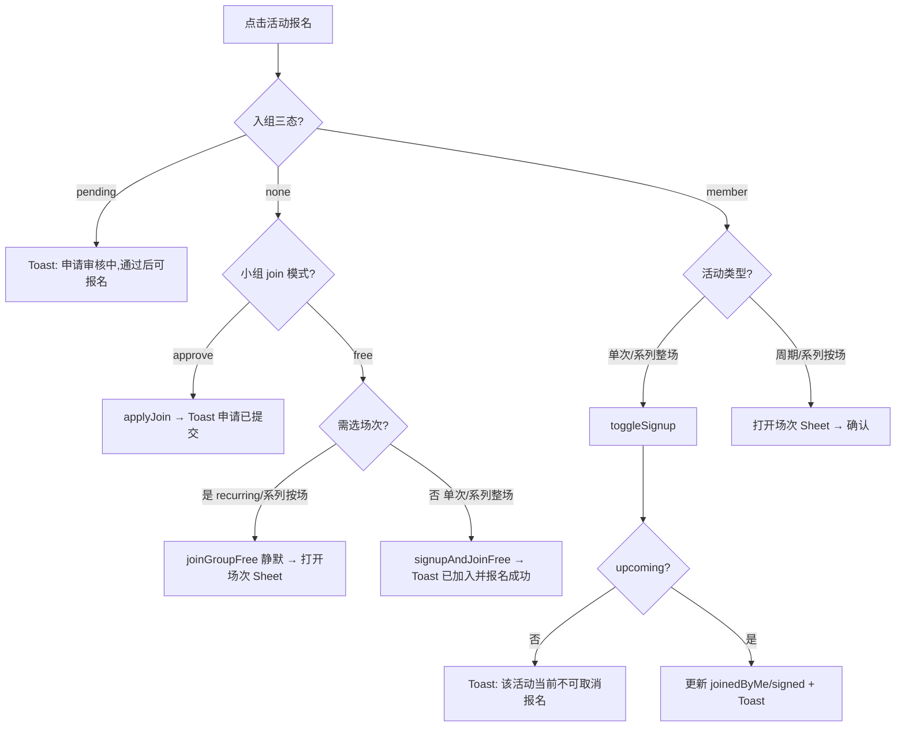
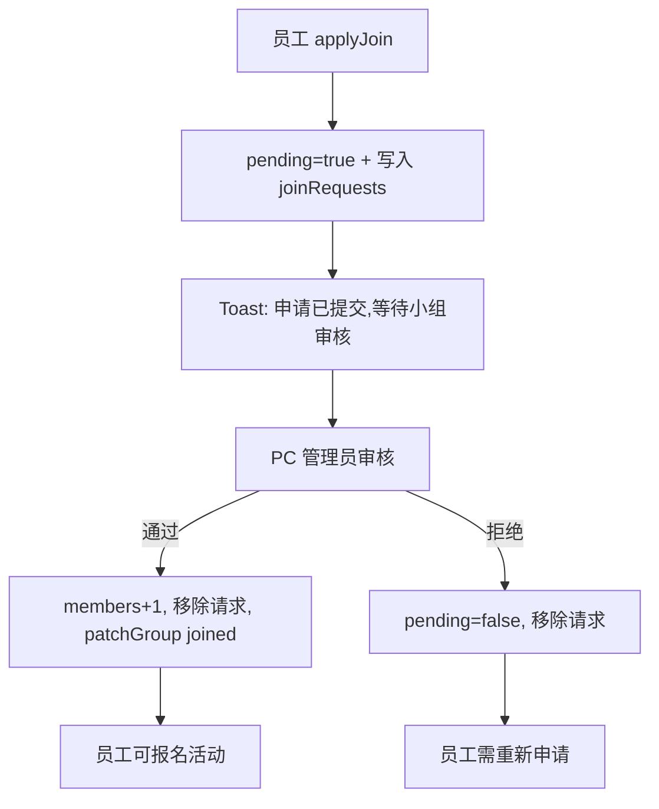
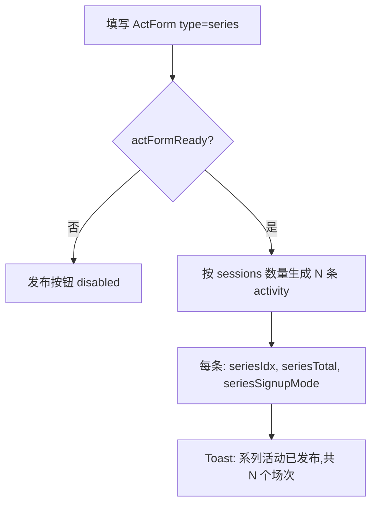
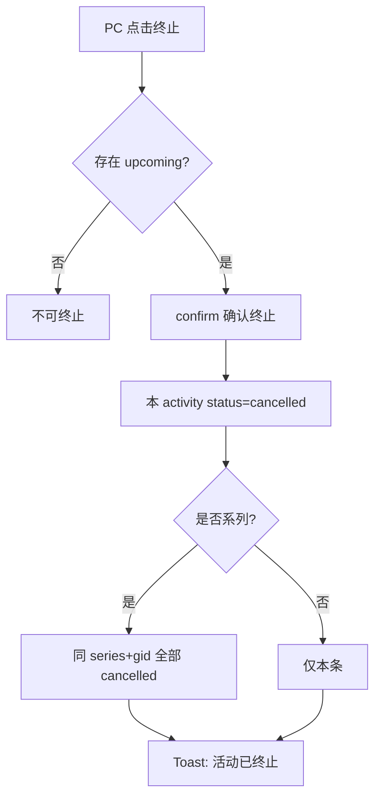

# EXP 兴趣小组产品需求文档（PRD）

> **文档说明**：本文档完全基于项目 `site/` 源代码逆向分析生成，反映当前已实现的产品行为。  
> **版本**：v2.0（代码快照：2026-06-03）  
> **代码形态**：浏览器内运行的 React JSX 原型，数据存于内存与 `window.DB`，无独立后端服务。

---

## 1. 项目背景、业务目的、量化业务指标

### 1.1 项目背景

EXP 兴趣小组是企业内部员工兴趣社交与活动组织产品，包含**移动员工端**（当前用户：林浅）与 **PC 管理端**（HR/组长视角：陈航）。员工在移动端发现小组与活动、申请入组、按场次报名、发布精彩瞬间；管理员在 PC 端创建小组/活动、审核入组申请、管理报名与评论、终止或删除活动。

产品嵌入 EXP 智能体生态：首页可进入 AI 兴趣助手对话，IM 列表含「沟通引擎」通知通道。

### 1.2 业务目的

| 目的 | 产品价值 |
|------|----------|
| 降低活动发现成本 | 首页推荐/最新/热门活动 + AI 助手关键词匹配 |
| 规范入组与报名关系 | **必须先加入小组（或提交审核）才能报名活动** |
| 覆盖多形态活动 | 单次、周期（按场次独立报名）、系列（整场或按场次） |
| 支撑组长运营 | PC 端审核入组、查看报名、终止/删除活动 |
| 沉淀活动回忆 | 活动结束后，参与者可发布精彩瞬间到小组圈 |
| 及时触达 | 沟通引擎通知：开场提醒、报名、入组、评论、取消 |

### 1.3 量化业务指标

> 代码中无埋点实现，以下为基于产品能力推导的可观测指标，需正式环境接入统计后验证基线。

| 指标 | 定义 | 目标方向 | 周期 |
|------|------|----------|------|
| 入组转化率 | 小组详情/卡片曝光 → 成功入组或提交审核 | ≥ 20% | 月 |
| 审核通过率 | PC 通过申请数 / 全部待审核申请 | ≥ 85% | 月 |
| 活动报名转化率 | 活动详情曝光 → 成功报名 | ≥ 30% | 月 |
| 零报名活动占比 | `signed=0` 且 `status=upcoming` 的活动 / 全部 upcoming | ≤ 15% | 周 |
| 精彩瞬间发布率 | 已结束且本人已报名活动 → 发布精彩瞬间 | ≥ 10% | 月 |
| AI 助手点击率 | 首页 AI 入口点击 / 首页 UV | ≥ 25% | 月 |
| 沟通引擎已读率 | 通知标记已读 / 通知下发 | ≥ 60% | 月 |

---

## 2. 目标用户画像与使用场景

### 2.1 用户角色

| 角色 | 身份标识 | 使用端 | 核心能力 |
|------|----------|--------|----------|
| 普通员工 | 林浅（`DB.ME`） | 移动员工端 | 浏览、申请/加入小组、报名、评论、发精彩瞬间 |
| HR/组长 | 陈航（PC 默认组长） | PC 管理端 | 建组、发活动、审核入组、终止/删除活动、删评论 |
| AI 助手 | 小趣 | 移动端对话 | 关键词推荐活动卡片，卡片内可报名 |

### 2.2 用户画像

**画像 A：活动参与者（林浅型）**  
28 岁产品岗，想参加羽毛球、夜跑，但不熟悉各组规则。需要首页推荐 + AI 帮找活动，入组流程清晰。

**画像 B：徒步组长（苏曼型）**  
周末徒步组设为「审核加入」，需控制成员质量。在 PC 端批量通过入组申请，查看各场次报名。

**画像 C：HR 运营（陈航型）**  
需掌握全公司小组与活动数据，处理零报名活动，必要时终止或删除活动。

### 2.3 典型使用场景

| 编号 | 场景 | 路径 |
|------|------|------|
| S1 | 首页发现活动并报名 | 首页 → 活动详情 → 入组+报名 |
| S2 | 审核制小组申请入组 | 活动详情 → 申请加入 → PC 审核通过 → 返回报名 |
| S3 | 周期活动选场次报名 | 活动详情 → 调整报名场次 Sheet → 确认 |
| S4 | PC 发布系列活动 | PC 新建活动 → 系列多场次 → 发布 |
| S5 | 活动结束发精彩瞬间 | 小组圈 → 发布 → 选已结束且已报名活动 |
| S6 | AI 找羽毛球活动 | AI 对话输入「羽毛球」→ 卡片 → 报名 |
| S7 | 退出小组连带取消报名 | 小组详情 → 已加入 → 确认退出 |
| S8 | PC 终止系列活动 | PC 活动详情 → 终止 → 全系列 cancelled |

---

## 3. 需求范围（MoSCoW）

### 3.1 Must Have（已实现）

- 移动员工端首页（活动 Tab：推荐/最新/热门；热门小组横滑；AI 入口）
- 活动详情、小组详情、全部活动/小组列表
- 我的小组、我的活动（已报名活动列表）
- 入组：自由加入 / 审核加入；三态：未入组 / 审核中 / 已入组
- 活动报名：单次 toggle；周期/系列按场次 Sheet 多选
- 系列两种报名方式：按场次独立 / 整场一次
- PC 管理端：工作台、小组管理、活动管理、报名管理、评论管理、小组圈管理
- PC 入组审核（通过/拒绝/批量通过）
- 活动创建/编辑/删除/终止
- 小组创建/编辑/删除
- AI 兴趣助手（关键词匹配 + 活动卡片）
- AI 活动策划 Composer（一句话生成活动方案）
- 沟通引擎通知列表
- 活动评论（移动端发表；PC 端删除）
- 精彩瞬间发布（PostMoment → 小组圈）
- 报名截止 UI 配置 + 倒计时展示

### 3.2 Should Have（部分实现）

- 报名截止规则配置（PC 表单有，**C 端报名未校验截止**）
- 跨天/多天活动时间展示（`endDate`、`spanDays`）
- 周期活动仅展示最近 5 场（`RECENT_SESSIONS_MAX=5`）
- 悦生活「我的报名」「我的互动」页面（mock 数据，非兴趣小组核心）

### 3.3 Could Have（类型/字段存在，未完整实现）

- 周期「每月重复」（`repeatMode: monthly` 校验分支存在，**表单无每月选择 UI**）
- 小组群聊（`groupchat` 路由存在，**mock 无 group 会话**）
- 真实图片上传到服务器（当前为 base64 / seed 占位）
- 真实 LLM AI（当前为 setTimeout + 模板文案）

### 3.4 Won't Have（本期明确不做）

- 后端 API 与数据库持久化
- 生产级 SSO 与权限体系
- 向量检索推荐
- 支付、签到核销、直播
- 解散小组（仅有删除小组 `delGroup`）
- 自发组工会报备 Banner
- 埋点 SDK（代码零实现）
- 报名无需入组（与本原型规则相反）

---

## 4. 产品名词、业务术语统一注释

| 术语 | 定义 |
|------|------|
| 兴趣小组 | 以共同兴趣聚合员工的组织单元，含分类、组长、成员数、加入方式 |
| 自由加入 | `join: free`，员工点击即可入组，`members+1` |
| 审核加入 | `join: approve`，员工提交申请进入 `pending`，PC 审核通过后入组 |
| 入组三态 | `member`（已入组）/ `pending`（审核中）/ `none`（未入组） |
| 活动 | 小组下的可报名事项，类型：`once` 单次 / `recurring` 周期 / `series` 系列 |
| 周期活动 | 按周重复，含 `sessions[]` 各场次独立 `signed` 与 `joinedByMe` |
| 系列活动 | 同一 `series` 名称下多期活动，每期为独立 activity 行 |
| 按场次报名 | `seriesSignupMode: independent`，每期独立报名 |
| 整场报名 | `seriesSignupMode: all`，报一次参与全部期次，各期 `signed` 同步 |
| 报名+入组 | 未入组员工在卡片上的合并操作入口 |
| 调整场次 | 已报名周期/系列按场次活动的场次增删 |
| 精彩瞬间 | 活动 `status=ended` 且本人 `joinedByMe` 后，可发图文到小组圈 |
| 沟通引擎 | 系统通知通道，含提醒/报名/入组/评论/取消五类 |
| 活动状态 | `upcoming` 可报名 / `ended` 已结束 / `cancelled` 已终止 |
| 零报名活动 | `signed=0` 的 upcoming 活动，PC 可删除 |

---

## 5. 全模块通用全局规则

### 5.1 入组与报名

| 规则编号 | 规则 | 验收标准 |
|----------|------|----------|
| G-01 | **必须先入组才能报名**（审核通过或自由加入） | 未入组且无 pending 时，活动卡片显示「报名+入组」 |
| G-02 | `pending` 态不可报名 | 点击报名 Toast「申请审核中,通过后可报名」 |
| G-03 | 审核制小组未入组时，点击报名仅提交入组申请 | Toast「申请已提交,等待小组审核,通过后可报名」 |
| G-04 | 自由加入 + 单次/系列整场：一键「入组+报名」 | Toast「已加入小组,报名成功」 |
| G-05 | 自由加入 + 周期/系列按场次：先入组再打开场次 Sheet | 静默入组后跳转详情并 `pickEnroll:true` |
| G-06 | 退出小组前若有报名，二次确认 | 弹窗含「退出后将取消你在该小组 N 个活动的报名,确认退出?」 |
| G-07 | 确认退出后取消该组全部报名 | 所有 `joinedByMe` 及 session 级报名清除，`members-1` |
| G-08 | 场次已满不可新增勾选 | Sheet 中 `signed >= cap && !joinedByMe` 的场次不可选 |
| G-09 | 取消报名仅 `status=upcoming` 允许 | 否则 Toast「该活动当前不可取消报名」 |

### 5.2 活动终止与删除

| 规则 | 说明 |
|------|------|
| 终止 | `status → cancelled`；系列则同 `series`+`gid` 全部期 cancelled |
| PC 终止条件 | 至少存在一个 `upcoming` 场次/期 |
| 删除活动 | 仅当 `signed === 0`；系列删除移除整个系列全部期 |
| 删除小组 | PC 确认「确认删除该小组?」，从列表移除，无级联规则 |

### 5.3 展示与数量限制

| 项目 | 限制 |
|------|------|
| 首页热门小组 | 最多 5 条；`hot` 置顶，其余按 members、acts 降序 |
| 首页每 Tab 活动 | 各 3 条 |
| 周期场次 C 端展示 | 最近 5 场（`RECENT_SESSIONS_MAX=5`） |
| 精彩瞬间图片 | 最多 9 张（`PostMoment`） |
| PC 活动详情头像 | 最多 8 个（4×2） |
| PC 报名列表头像 | 最多 20 个 |
| Toast 展示时长 | 2400ms |
| AI 回复延迟 | 对话 1000ms；Composer 1700ms；简介生成 1200ms |

### 5.4 跨端同步

| 规则 | 说明 |
|------|------|
| C 端申请入组 | 写入 `DB.joinRequests`，PC 可见 |
| PC 通过本人申请 | `DBH.patchGroup` 写回 `joined:true, pending:false`，C 端切回可报名 |
| PC 拒绝本人申请 | `pending:false`，C 端恢复未入组 |

### 5.5 已知原型缺口（须写入验收边界）

| 缺口 | 产品行为 |
|------|----------|
| 报名截止未拦截 | `deadlineMode` 仅展示倒计时，**不阻止** C 端报名操作 |
| 每月周期 | 类型支持但表单无 UI |
| 无持久化 | 刷新页面恢复 mock 初始数据（除 localStorage 富文本颜色） |

---

## 6. 分模块详细产品需求

### 6.1 移动员工端 · 首页（HomeTab）

**入口**：Showcase 切换「移动员工端」，默认 Tab。

#### 前置条件
- 用户为林浅，已加载 `DB.groups`、`DB.acts`

#### 正常流程
1. 顶部 AI 搜索条 + 三个快捷 chip（「周末的羽毛球活动」「适合新人的小组」「本周还有什么活动」）→ 跳转 `aichat`
2. 活动区 Tab：推荐 / 最新 / 热门，各展示 3 张活动卡片
3. 「热门小组」横滑最多 5 条，「全部」→ `allGroups`
4. 「本周高光」展示小组圈精彩瞬间预览
5. 底部 Tab 导航（首页/小组圈/消息/我的）

#### 全场景异常

| 场景 | 展示 |
|------|------|
| 推荐 Tab 无数据 | 「暂无推荐活动」 |
| 最新 Tab 无数据 | 对应 Empty 文案 |
| 热门 Tab 无数据 | 「暂无热门活动」 |

#### 交互说明
- 活动卡片点击 → `activity` 详情
- 卡片报名按钮走 `handleActivityEnrollClick` 统一逻辑

#### 验收标准
- [ ] 三个活动 Tab 各最多 3 条
- [ ] 热门小组 ≤5 条，含 `hot:true` 的小组优先
- [ ] 点击 AI chip 进入对话页且可发送对应文案

---

### 6.2 AI 兴趣助手（AIChat）

**路由**：`nav.go('aichat')`

#### 前置条件
- 无

#### 正常流程
1. 展示历史消息 + 活动卡片
2. 用户输入或点击建议问题发送
3. 1000ms 后 AI 回复文本 + 最多若干活动卡片（`ChatActCard`）
4. 卡片上可「报名」→ `toggleSignup`

#### 意图匹配规则

| 用户输入包含 | 返回卡片 | 回复主题 |
|--------------|----------|----------|
| 羽毛球 | a5 | 本周羽毛球，余 2 位 |
| 周末 | a2, a6 | 徒步 + 探店 |
| 新人 / 新手 / 小组 | a3, a4 | 桌游 + 读书 |
| 其他 | a1, a3 | 运动/桌游推荐 |

#### 建议问题
- 帮我找周末的羽毛球活动
- 推荐适合新人的小组
- 本周还有什么活动

#### 全场景异常
- 空输入不发送

#### 验收标准
- [ ] 输入「羽毛球」仅返回 a5 卡片
- [ ] 输入「周末」返回 2 张卡片
- [ ] 卡片报名成功 Toast「报名成功,已通知发起人」（需已入组）

---

### 6.3 活动详情（ActivityDetail）

**路由**：`nav.go('activity', { aid, pickEnroll? })`

#### 前置条件
- 活动 ID 存在于 `store.acts`

#### 正常流程
1. 展示封面、标题、所属小组、类型标签、时间地点、富文本介绍
2. **未入组**：展示入组提示条 + 「申请加入」或「加入小组并报名」
3. **已入组 + 单次/系列整场**：「立即报名」/「取消报名」
4. **已入组 + 周期/系列按场次**：「选场次报名」或「调整场次」→ 底部 Sheet
5. Sheet：勾选场次，已满不可新增；确认后批量更新
6. 已结束活动：详情默认折叠，点击「查看活动详情」展开
7. 评论区：输入发表，Toast「评论已发布」

#### 全场景异常

| 场景 | 处理 |
|------|------|
| pending 态点报名 | Toast「申请审核中,通过后可报名」 |
| 审核制未入组 | 仅 `applyJoin`，不自动报名 |
| 取消非 upcoming | Toast「该活动当前不可取消报名」 |
| 场次 Sheet 无变更 | Toast「报名场次已更新」 |
| 新增 N 场 | Toast「已报名 N 个场次,已通知发起人」 |
| 取消 N 场 | Toast「已取消 N 个场次」 |
| 混合增减 | Toast「报名场次已更新」 |

#### 交互说明
- Sheet 文案：「勾选新增、取消勾选移除，确认后生效（已满场次不可新增）」
- 周期场次区标注「仅显示最近 5 场」
- 报名截止：有 `deadlineIso` 时展示倒计时（天/小时/分/秒）；过期显示「已截止报名」

#### 验收标准
- [ ] 未入组看不到「立即报名」，仅有入组相关按钮
- [ ] 自由加入+周期活动：入组后自动打开场次 Sheet（`pickEnroll:true`）
- [ ] 系列 `all` 模式：任一期 `joinedByMe` 即视为系列已报名
- [ ] 已结束活动默认折叠详情

---

### 6.4 小组详情（GroupDetail）

**路由**：`nav.go('group', { gid })`

#### 正常流程
1. 展示小组信息、标签、简介、成员数
2. 入组按钮三态：加入 / 申请加入 / 已加入（点击退出）
3. 小组活动列表
4. 入口：小组圈、发布动态

#### 全场景异常

| 场景 | 处理 |
|------|------|
| pending 点击入组 | Toast「申请审核中,通过后可报名」 |
| 自由加入 | Toast「已加入小组,欢迎!」 |
| 审核申请 | Toast「申请已提交,等待小组审核,通过后可报名」 |
| 退出有报名时 | confirm 后取消全部组内报名，Toast「已退出小组」 |

#### 验收标准
- [ ] `join:approve` 组显示「申请加入」
- [ ] 已加入按钮文案「已加入」，点击触发退出确认

---

### 6.5 全部活动 / 我的活动 / 我的小组

#### AllActivities
- 筛选：全部 / 本周 / 本月 + 搜索
- 空态：「没有匹配的活动」/「该状态下暂无活动」

#### MyActivities
- 展示 `joinedByMe` 或 session 有 `joinedByMe` 的活动
- 空态：「还没有报名任何活动」

#### MyGroups
- 展示 `joined:true` 的小组
- 空态：「还没有加入任何小组」+「去探索」按钮

#### AllGroups
- 搜索小组名称、分类、标签
- 空态：「没有匹配的小组」/「暂无小组」

#### 验收标准
- [ ] 本周筛选按周一至周日范围（原型基准日期 06月03日周一）
- [ ] 我的活动不含仅创建未报名的活动

---

### 6.6 精彩瞬间发布（PostMoment）

**路由**：`nav.go('post', { gid?, aid? })`

#### 前置条件
- 存在 `status=ended && joinedByMe` 的活动（`DBH.canPostMoment`）

#### 正常流程
1. 选择已参与且已结束的 activity
2. 输入文字 + 最多 9 张图片
3. 发布到小组圈，Toast「精彩瞬间已发布到小组圈」

#### 全场景异常

| 场景 | 处理 |
|------|------|
| 未选活动点发布 | Toast「请选择你参与过的已结束活动」 |
| 不满足 canPostMoment | Toast「仅报名参与的活动结束后可发布精彩瞬间」 |
| 无可选活动 | 文案「暂无可发布的活动。只有报名参加了活动，在活动结束后才可以发布精彩瞬间。」 |

#### 验收标准
- [ ] 未报名或未结束的活动不在可选列表
- [ ] 发布后出现在小组圈与首页「本周高光」

---

### 6.7 沟通引擎（NotifyThread）

**路由**：`nav.go('notify')` 或 IM 会话 `kind:notify`

#### 通知类型

| kind | 含义 | 示例 |
|------|------|------|
| reminder | 开场提醒 | 你报名的「滨江 8K 夜跑」明天 19:30 开始… |
| signup | 他人报名 | 许墨 报名了你创建的活动「…」 |
| join | 新成员 | 邵阳 加入了你管理的小组「城市夜跑团」 |
| comment | 评论 | 许墨 评论了「滨江 8K 夜跑」:… |
| cancel | 取消报名 | 罗茜 取消了「看日出系列」整场报名… |

#### 验收标准
- [ ] 列表展示 `text`、`time`、已读/未读态
- [ ] 含 `aid`/`gid` 的通知可跳转对应详情

---

### 6.8 PC 管理端 · 工作台（Dashboard）

**入口**：Showcase「PC 管理端」→ 默认 `section: dashboard`  
**源码**：`site/assets/5f3ec28e-…js` → `Dashboard()`；卡片组件 `StatCard` 在 `06091f2a-…js`

#### 顶部统计卡片（4 项）

卡片右上角 **delta**（如 `+2`、`+18%`）表示**相对上一统计周期的变化量**；原型中为静态 mock，正式环境需按周期实时计算。

| 指标 | 含义 | 建议统计周期 | 建议计算公式 | 原型当前实现 |
|------|------|--------------|--------------|--------------|
| **活跃小组** | 当前在运营、对员工可见且未被归档/下架的兴趣小组数量 | 实时快照（日切无影响） | `COUNT(groups WHERE status = active)`；若无归档字段则等价于全部小组 | `store.groups.length`（当前 mock 共 **8** 个） |
| **参与成员** | 已加入至少一个兴趣小组的员工规模（运营视角的「覆盖面」） | 实时快照 | **推荐去重**：`COUNT(DISTINCT employee_id FROM group_memberships WHERE status = joined)` | 写死 **758**（恰等于 mock 各小组 `members` 之和：128+96+…+87，**未去重**，同一人多组会被重复计数） |
| **本周活动** | 本自然周内将要发生或正在报名中的活动场次数 | 自然周（周一 00:00 — 周日 23:59，按企业时区） | 见下方「活动场次计数规则」；仅计 `status ∈ {upcoming}`，不含 `ended` / `cancelled` | `store.acts.filter(a => a.status === 'upcoming').length`（**全部未结束活动**，非严格「本周」；mock 约 **21** 条） |
| **本周报名人次** | 本自然周内产生的有效报名记录数（人次，非去重人数） | 自然周（同上） | 见下方「报名人次计数规则」 | 写死 **312**；与下方趋势图 W8 柱顶一致 |

**活动场次计数规则（建议，供正式环境）**

| 活动类型 | 是否计入「本周活动」 | 计数单位 |
|----------|----------------------|----------|
| 单次 `once` | 首场 `date` 落在本周 | 1 场 |
| 周期 `recurring` | 本周内至少 1 个 `sessions[]` 场次开放报名 | 按本周开放场次数计，或按活动母单计 1（需产品定口径；推荐按**场次**） |
| 系列 `series` | 本周内至少 1 期 `status = upcoming` | 按**期**计（`seriesSignupMode = all` 仍按期时间判断是否在本周） |

**报名人次计数规则（建议，供正式环境）**

| 事件 | 是否计入 | 说明 |
|------|----------|------|
| 员工首次报名某场次/某期 | ✓ +1 | 以报名成功时间戳落在本周为准 |
| 同一场次取消后再报 | ✓ +1 | 每次成功报名各计 1 人次（人次非人数） |
| 周期/系列调整场次（增选） | ✓ 仅新增场次 | 新勾选且确认的场次各 +1 |
| 周期/系列取消场次 | ✗ 不减 | 历史人次不回溯扣减 |
| 活动 `cancelled` 后存量报名 | 视口径 | 推荐：终止时刻前已发生的报名仍计入当周；终止后新报名不计 |

**delta 变化量（建议公式）**

| 指标 | delta 形式 | 公式 |
|------|------------|------|
| 活跃小组 | 绝对值，如 `+2` | `本期值 − 上期值`（上期 = 7 日前快照或上周同期） |
| 参与成员 | 绝对值，如 `+46` | `本期去重成员数 − 上期去重成员数` |
| 本周活动 | 绝对值，如 `+3` | `本周场次数 − 上周场次数`（同比周） |
| 本周报名人次 | 百分比，如 `+18%` | `(本周人次 − 上周人次) / 上周人次 × 100%`，上周为 0 时仅展示绝对增量 |

#### 近 8 周活动参与趋势（MiniBars）

**位置**：工作台左侧大卡片 · 标题「近 8 周活动参与趋势」· 副标题「报名人次 · 持续上升」  
**组件**：`MiniBars`（`5f3ec28e-…js`），柱状图，最后一柱（W8）高亮色，其余为浅色；柱顶 `title` 悬浮显示数值。

##### 指标定义

| 项 | 说明 |
|----|------|
| **指标名称** | 活动参与趋势（以报名人次衡量） |
| **核心度量** | **报名人次** — 与顶部 StatCard「本周报名人次」**同一统计口径** |
| **业务含义** | HR/运营观察近 2 个月内员工参与兴趣小组活动的**报名活跃度**是否上升、波动或下滑；用于活动排期、资源投入与推广节奏判断 |
| **不是** | 不等于「参与人数（去重）」「活动举办场次数」「签到到场人次」「小组加入人数」 |

##### 统计周期

| 项 | 规则 |
|----|------|
| **时间窗口** | 滚动 **8 个自然周**（非 8×7 固定天数滑动窗） |
| **周界** | 周一 00:00:00 — 周日 23:59:59（企业默认时区，如 `Asia/Shanghai`） |
| **横轴 W1…W8** | W8 = **含「今天」在内的当前自然周**；W7 = 上一完整周；…；W1 = 第 8 周前的那一周 |
| **刷新** | 建议日切后重算；本周（W8）随新报名**累计增长**，历史周（W1–W7）**固化不再变** |
| **原型基准日** | mock 隐含「今天」为 **2026-06-03（周二）**，W8 对应该周 6/2（一）— 6/8（日） |

##### 计算公式（建议 · 正式环境）

```
FOR i IN 1..8:
  week_i = 第 (8-i) 个自然周   // i=8 → 本周，i=1 → 最早一周
  trend[i] = COUNT(signup_events)
             WHERE signup_at ∈ week_i
             AND event_type = 'activity_signup_success'
             AND is_valid = true
```

**单条 `signup_event` 计 1 人次，规则与「本周报名人次」一致：**

| 场景 | 是否计入该周 |
|------|--------------|
| 单次活动报名成功 | ✓，按 `signup_at` 所在周 |
| 周期活动某场次报名/增选 | ✓，按该场次确认报名的时刻 |
| 系列活动某期报名（`independent` 按场次 / `all` 整场一次） | ✓，按对应报名确认时刻 |
| 取消报名 | ✗ 不回溯扣减历史周数据 |
| 取消后再报 | ✓ 每次成功各计 1 |
| 活动 `cancelled` 前已发生报名 | ✓ 保留在发生当周 |
| 活动 `cancelled` 后新报名 | ✗ |
| 跨组重复报名同一场 | ✓ 各计 1（人次非人数） |

**伪代码示例：**

```sql
SELECT
  week_label,  -- W1..W8
  COUNT(*) AS signup_count
FROM activity_signup_events e
JOIN calendar_weeks w ON e.signup_at >= w.start AND e.signup_at < w.end
WHERE w.week_rank BETWEEN 1 AND 8  -- 1=最早, 8=本周
GROUP BY week_label
ORDER BY week_rank;
```

##### 图表展示规则

| 项 | 规则 |
|----|------|
| **纵轴** | 相对比例：柱高 = `该周人次 / max(8周人次) × 100%`，最小柱高 6px |
| **数值标签** | 仅横轴周次（W1…W8）；精确数值 hover 柱体 `title` 显示 |
| **副标题文案** | 「报名人次 · 持续上升」为**静态描述**；正式环境建议按 W7→W8 或近 4 周斜率自动生成（上升 / 持平 / 下降） |
| **与顶栏联动** | W8 柱值 **应等于** 顶栏「本周报名人次」；原型均为 **312** |

##### 原型当前实现

| 项 | 值 |
|----|-----|
| 数据来源 | **写死数组**，不读 `store.acts` / 报名流水 |
| 8 周数值 | W1=120, W2=145, W3=132, W4=178, W5=165, W6=210, W7=245, **W8=312** |
| 趋势解读 | 整体上升，W3/W5 为局部回落（mock 叙事用） |

##### 验收标准（正式环境）

- [ ] W8 与「本周报名人次」卡片数值一致
- [ ] W1–W7 仅统计各周 `[周一 00:00, 下周一 00:00)` 内报名事件
- [ ] 周期/系列按**场次/期**报名事件拆分，不按活动母单重复计数
- [ ] 取消报名不修改历史周柱高
- [ ] 时区与企业工作日历配置一致

---

| 项 | 说明 |
|----|------|
| **含义** | 需组长/管理员审批的「加入小组」申请队列 |
| **统计范围** | `joinRequests WHERE status = pending` 且对应小组 `join === 'approve'` |
| **原型公式** | `store.joinRequests.filter(r => r.status === 'pending' && group(r.gid).join === 'approve')` |
| **操作** | 单条通过/拒绝；「全部通过」批量审批 |

#### 近期活动表格

展示 `status === 'upcoming'` 的活动，按列表逻辑单元合并（系列/周期），默认最多 **4** 条；「查看全部」跳转活动管理。

#### 验收标准
- [ ] 待审核入组申请数与 `joinRequests` 中 pending 且审核制小组一致
- [ ] 「活跃小组」与小组列表总数一致（原型：`groups.length`）
- [ ] 「本周活动」正式环境需按自然周过滤，而非全部 upcoming（原型已知偏差）
- [ ] 「参与成员」「本周报名人次」及 delta 正式环境需接真实统计，不可写死

---

### 6.9 PC · 小组管理

#### 创建/编辑小组（GroupForm）

| 字段 | 必填 | 规则 |
|------|------|------|
| 封面 | 创建必填 | JPG/PNG，16:9 |
| 名称 | 是 | trim 非空 |
| 分类 | 否 | 8 类 CAT 枚举 |
| 组长 | 否 | 默认陈航 |
| 简介 | 否 | 可 AI 帮写 |
| 加入方式 | 否 | 自由加入 / 审核加入 |
| 活动区域 | 否 | 文本 |
| 标签 | 否 | `/` 分隔，保存时 split |

#### 全场景异常
- 创建缺名称或封面：提交按钮 disabled
- 成功：Toast「小组创建成功」/「小组已更新」
- 删除：confirm「确认删除该小组?」→ Toast「小组已删除」

#### 验收标准
- [ ] disabled 条件：`!(name.trim() && (init || cover))`
- [ ] 新建小组 `members:1, acts:0, joined:true`（创建者视角）

---

### 6.10 PC · 活动管理

#### 创建/编辑活动（ActForm）

**公共字段**

| 字段 | 创建必填 | 默认值 |
|------|----------|--------|
| 封面 | 是 | 空 |
| 标题 | 是 | 空 |
| 所属小组 | 是 | gidInit |
| 分类 | 否 | 随小组 |
| 类型 | 是 | once |
| 地点 | 否 | 空 |
| 人数上限 | 否 | 20 |
| 介绍 | 否 | 富文本，可 AI 生成 |
| 报名截止 | 否 | 不设置 |

**类型互斥字段**

| 类型 | 额外必填 |
|------|----------|
| once | dateValue + timeStart；endDateValue ≥ dateValue |
| recurring | timeStart + repeatWeekdays 至少 1 个 |
| series | sessions ≥1，每场 dateValue + timeStart |

**编辑约束**
- 活动类型创建后不可更改
- 编辑时不要求 cover（`actFormReady(f, true)` 不校验 cover）

#### 发布结果 Toast
- 单次/周期：「活动已发布」或「AI 活动已发布,已推送给小组成员」
- 系列：「系列活动已发布,共 N 个场次」
- 更新：「活动已更新」

#### 终止/删除

| 操作 | 条件 | 确认文案 | 结果 |
|------|------|----------|------|
| 终止 | 存在 upcoming | 「确认终止该活动？终止后状态不可恢复。」 | Toast「活动已终止」，系列全 cancelled |
| 删除 | signed=0 | 「确认删除该活动?」 | 系列则删全系列；Toast「活动已删除」 |

#### 验收标准
- [ ] 系列 3 场发布生成 3 条 activity，共享 `series` 名
- [ ] `seriesSignupMode:all` 时各期 `signupDeadline` 取首场 date
- [ ] signed>0 时删除按钮不可用或不可见

---

### 6.11 PC · 入组审核

#### 正常流程
1. 入组申请列表展示 pending 请求
2. 单条通过 → Toast「已通过 {name} 加入「{组名}」」
3. 单条拒绝 → Toast「已拒绝 {name} 的加入申请」
4. 批量通过 → Toast「已全部通过 N 条加入申请」

#### 全场景异常
- 本人申请（`self:true`）通过后 C 端 `joined:true`

#### 验收标准
- [ ] 通过后 `members+1`，请求从列表移除
- [ ] 拒绝本人申请后 C 端 `pending:false` 且未 joined

---

### 6.12 PC · 评论管理

- 删除评论：confirm「确认删除该评论？」→ Toast「评论已删除」
- 同步移除 `DB.comments` 中对应项

#### 验收标准
- [ ] 删除后 C 端活动详情评论列表同步减少

---

## 7. 关键业务流程（Mermaid）

### 7.1 入组与报名（C 端）



### 7.2 审核入组（C 端 → PC → C 端）



### 7.3 PC 发布系列活动



### 7.4 活动终止



---

## 8. 页面字段清单

### 8.1 PC 小组表单（GroupForm）

| 字段 | 必填 | 校验 | 枚举/选项 | 默认值 |
|------|------|------|-----------|--------|
| 封面 | 创建必填 | 图片 | — | 空 |
| 小组名称 | 是 | trim 非空 | — | 空 |
| 分类 | 否 | — | sport/learning/career/team/volunteer/game/movie/other | sport |
| 组长 | 否 | — | — | 陈航 |
| 简介 | 否 | — | — | 空 |
| 加入方式 | 否 | — | free / approve | free |
| 活动区域 | 否 | — | — | 空 |
| 标签 | 否 | `/` 分隔 | — | 空 |

### 8.2 PC 活动表单（ActForm）

| 字段 | 必填 | 校验 | 枚举 | 默认值 |
|------|------|------|------|--------|
| 封面 | 创建必填 | 图片 | — | 空 |
| 标题 | 是 | 非空 | — | 空 |
| 类型 | 是 | 创建后不可改 | once/recurring/series | once |
| 所属小组 | 是 | — | DB.groups | g1 |
| 分类 | 否 | — | CATS | 随小组 |
| 日期 | once/系列必填 | end≥start | — | 今天/预设 |
| 时段 | 是 | timeStart 必填 | — | 19:00-21:00 |
| 周期星期 | recurring 必填 | ≥1 个 weekday | 周一至周日 | [3,5] |
| 系列场次 | series 必填 | ≥1，每场完整 | — | 1 场默认 |
| 系列报名方式 | series | — | independent / all | independent |
| 地点 | 否 | — | — | 空 |
| 人数上限 | 否 | 数字 | — | 20 |
| 介绍 | 否 | 富文本 | — | 空 |
| 截止模式 | 否 | — | none/fixed/hours_before | none |
| 截止固定时间 | fixed 时 | date+time | — | 空 + 18:00 |
| 截止小时 | hours_before 时 | — | 1/2/3/6/12/24/48 | 2 |

### 8.3 移动活动评论

| 字段 | 必填 | 校验 |
|------|------|------|
| 评论文字 | 是 | trim 非空 |

### 8.4 精彩瞬间（PostMoment）

| 字段 | 必填 | 校验 |
|------|------|------|
| 关联活动 | 是 | ended + joinedByMe |
| 文字 | 否 | — |
| 图片 | 否 | ≤9 张 |

### 8.5 枚举汇总

**活动类型 type**：`once` | `recurring` | `series`  
**活动状态 status**：`upcoming` | `ended` | `cancelled`  
**加入方式 join**：`free` | `approve`  
**系列报名 seriesSignupMode**：`independent` | `all`  
**周期 repeatMode**：`weekly`（UI）| `monthly`（仅校验/展示，无 UI）  
**截止 deadlineMode**：`none` | `fixed` | `hours_before`  
**分类 cat**：sport / learning / career / team / volunteer / game / movie / other  
**通知 kind**：reminder / signup / join / comment / cancel

---

## 9. 数据操作清单（产品 API 契约）

> 当前为内存操作 `actions.*`，下表为建议 REST 映射，供后端对齐。

### 9.1 小组

| 操作 | 方法 | 路径 | 入参 | 返回字段 | 业务异常码 |
|------|------|------|------|----------|------------|
| 列表 | GET | `/groups` | q?, cat? | id,name,cat,members,acts,join,joined,pending,hot,tags,area,intro | — |
| 详情 | GET | `/groups/{id}` | — | 同上 | NOT_FOUND |
| 创建 | POST | `/groups` | name,cat,lead,join,area,tags,intro,cover | group | VALIDATION_ERROR |
| 更新 | PATCH | `/groups/{id}` | 可编辑字段 | group | NOT_FOUND |
| 删除 | DELETE | `/groups/{id}` | — | success | NOT_FOUND |
| 自由加入 | POST | `/groups/{id}/join` | — | joined,members | ALREADY_JOINED |
| 申请加入 | POST | `/groups/{id}/apply` | note? | pending | ALREADY_APPLIED |
| 退出 | POST | `/groups/{id}/leave` | — | success | HAS_ENROLLMENTS 需确认 |
| 审核通过 | POST | `/join-requests/{id}/approve` | — | member,members | NOT_PENDING |
| 审核拒绝 | POST | `/join-requests/{id}/reject` | — | success | NOT_PENDING |

### 9.2 活动

| 操作 | 方法 | 路径 | 入参 | 返回字段 | 业务异常码 |
|------|------|------|------|----------|------------|
| 列表 | GET | `/activities` | range?,q?,status? | id,gid,title,type,status,date,time,signed,cap,joinedByMe,sessions? | — |
| 详情 | GET | `/activities/{id}` | — | 完整 activity + group | NOT_FOUND |
| 创建 | POST | `/activities` | ActForm 字段 | activity 或 activities[] | VALIDATION_ERROR |
| 更新 | PATCH | `/activities/{id}` | 可编辑字段（不含 type） | activity | TYPE_LOCKED |
| 删除 | DELETE | `/activities/{id}` | — | success | HAS_SIGNUPS |
| 终止 | POST | `/activities/{id}/terminate` | — | status=cancelled | NO_UPCOMING |
| 报名 | POST | `/activities/{id}/signup` | sessionIds? | joinedByMe,signed | NOT_MEMBER,PENDING,NOT_UPCOMING,FULL |
| 取消报名 | POST | `/activities/{id}/cancel-signup` | sessionIds? | success | NOT_UPCOMING,NOT_ENROLLED |

### 9.3 社交与内容

| 操作 | 方法 | 路径 | 入参 | 返回 | 异常码 |
|------|------|------|------|------|--------|
| 发表评论 | POST | `/activities/{id}/comments` | text | comment | EMPTY |
| 删除评论 | DELETE | `/comments/{id}` | — | success | NOT_FOUND |
| 发精彩瞬间 | POST | `/groups/{gid}/moments` | aid,text,imgs[] | moment | NOT_ELIGIBLE |
| 通知列表 | GET | `/notifications` | — | id,kind,text,time,read,aid?,gid? | — |

### 9.4 AI

| 操作 | 方法 | 路径 | 入参 | 返回 |
|------|------|------|------|------|
| 对话 | POST | `/ai/chat` | message | answer,cardActivityIds[] |
| 策划生成 | POST | `/ai/compose-activity` | prompt | ActForm 草稿 |

### 9.5 业务异常码与用户文案映射

| 码 | 用户可见文案 |
|----|--------------|
| PENDING_JOIN | 申请审核中,通过后可报名 |
| APPLY_SUBMITTED | 申请已提交,等待小组审核,通过后可报名 |
| JOIN_SUCCESS | 已加入小组,欢迎! |
| SIGNUP_JOIN_SUCCESS | 已加入小组,报名成功 |
| SIGNUP_SUCCESS | 报名成功,已通知发起人 |
| SIGNUP_SESSIONS | 已报名 N 个场次,已通知发起人 |
| CANCEL_SESSIONS | 已取消 N 个场次 |
| SIGNUP_UPDATED | 报名场次已更新 / 未做更改 |
| CANCEL_SIGNUP | 已取消报名 |
| CANCEL_BLOCKED | 该活动当前不可取消报名 |
| LEAVE_CONFIRM | 退出后将取消你在该小组 N 个活动的报名,确认退出? |
| LEAVE_SUCCESS | 已退出小组 |
| MOMENT_NEED_ACT | 请选择你参与过的已结束活动 |
| MOMENT_NOT_ELIGIBLE | 仅报名参与的活动结束后可发布精彩瞬间 |
| MOMENT_PUBLISHED | 精彩瞬间已发布到小组圈 |
| TERMINATE_CONFIRM | 确认终止该活动？终止后状态不可恢复。 |
| ACT_TERMINATED | 活动已终止 |
| GROUP_DELETED | 小组已删除 |
| JOIN_APPROVED | 已通过 {name} 加入「{组}」 |
| JOIN_REJECTED | 已拒绝 {name} 的加入申请 |

---

## 10. 埋点需求与非功能需求

### 10.1 埋点清单（代码未实现，建议）

| 事件 | 触发 | 属性 |
|------|------|------|
| ig_home_view | 进入首页 | tab |
| ig_ai_entry_click | 点击 AI 入口/chip | source |
| ig_ai_message | 发送 AI 消息 | keyword_matched |
| ig_group_apply | 提交入组申请 | gid, join_mode |
| ig_group_join | 自由加入 | gid |
| ig_group_leave | 退出小组 | gid, cancelled_act_count |
| ig_act_signup | 报名成功 | aid, type, session_count |
| ig_act_cancel | 取消报名 | aid |
| ig_act_comment | 发表评论 | aid |
| ig_moment_post | 发精彩瞬间 | gid, aid, img_count |
| ig_pc_join_approve | PC 通过入组 | req_id, gid |
| ig_pc_act_publish | PC 发布活动 | type, session_count, ai |
| ig_pc_act_terminate | PC 终止 | aid |
| ig_notify_read | 通知已读 | kind |

### 10.2 性能

| 项 | 要求 |
|----|------|
| 首屏 | 移动首页 LCP ≤ 2.5s（4G）[目标] |
| AI 回复 | 原型 1000ms；正式 LLM ≤ 3s P95 |
| 列表 | 单页 ≤50 条，滚动 60fps |
| 图片 | 封面 lazy load；正式环境 CDN |

### 10.3 兼容性

| 项 | 要求 |
|----|------|
| 浏览器 | iOS Safari 15+、Chrome 90+、微信内置浏览器 |
| PC 管理端 | Chrome/Edge 最新两版，最小宽度 1280px |
| 部署 | 需 HTTP 服务（禁止 file://，Babel 浏览器编译） |

### 10.4 安全与合规

| 项 | 要求 |
|----|------|
| 身份 | 正式环境 SSO，禁止固定 ME/陈航 |
| 审核 | 审核加入小组须留痕 |
| 内容 | 评论/精彩瞬间须接入审核（原型无） |
| 数据 | 员工仅能删自己的评论（PC 管理员可删任意） |

---

## 11. 项目风险与上线注意事项

### 11.1 风险

| 风险 | 影响 | 缓解 |
|------|------|------|
| 无后端持久化 | 刷新丢数据 | 优先 API + DB |
| 报名截止未 enforcement | 运营规则失效 | 后端统一校验 deadline |
| 关键词 AI | 覆盖率低 | 逐步接 LLM + 意图表 |
| 入组前置规则 | 与「报名≠入组」竞品习惯不同 | 产品明确宣导 |
| 系列数据模型 | 多 activity 行，统计复杂 | 报表以 series 聚合 |
| 跨端 sync 靠 DB 突变 | 多用户冲突 | 改服务端状态机 |
| 无埋点 | 无法验证 §1.3 指标 | 上线前接入 |

### 11.2 上线注意事项

1. **入组规则**：全员培训「先加入/过审再报名」，卡片「报名+入组」需在 UI 规范中固定。
2. **审核 SLA**：建议 48h 内 PC 处理 pending 申请，避免员工长期无法报名。
3. **截止规则**：上线前必须补齐 C 端报名拦截，与倒计时展示一致。
4. **终止 vs 删除**：终止保留记录；删除仅零报名，系列需二次确认影响范围。
5. **Mock 数据清理**：`林浅/陈航`、假员工填充逻辑须替换为真实组织数据。
6. **PC/C 端权限**：正式环境按组长/HR 角色授权，非全员可进 PC。
7. **沟通引擎**：改 Push/企微，勿依赖用户打开页面。
8. **回归矩阵**：2 种 join × 3 种 type × 2 种 seriesSignupMode = 12 核心路径必测。

---

## 附录：Showcase 顶层视图

| 视图 | 说明 |
|------|------|
| mobile | 移动员工端（兴趣小组 App） |
| pc | PC 管理控制台 |
| im | IM 会话列表（含 AI、沟通引擎、私信） |
| appmy | 悦生活「我的」（含 mock 我的报名/互动） |

---

**文档状态**：DONE — 基于 `site/` 全部 JSX/数据逻辑逆向完成，未读取任何已有 PRD 文件。

**决策摘要**
- 以当前 `site/` 解包原型为准（非历史 `src/` 工程）
- 明确「先入组后报名」与「截止未拦截」两条关键规则
- API 表为产品契约，标注原型函数映射

**待验证假设**
- §1.3 指标目标需上线后验证
- 每月周期、群聊、deadline  enforcement 为已知缺口

**建议下一步**：评审本 PRD 与后端接口设计；优先补齐 deadline 校验与持久化后再 UAT。
