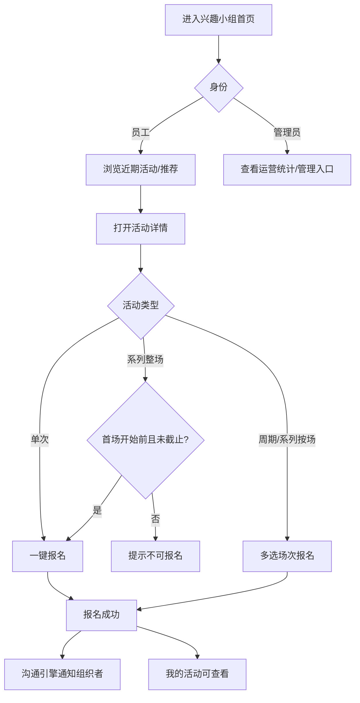
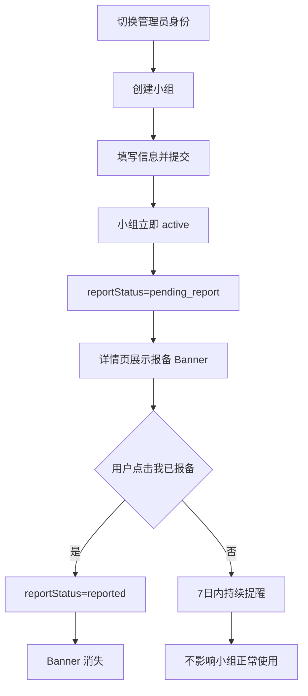
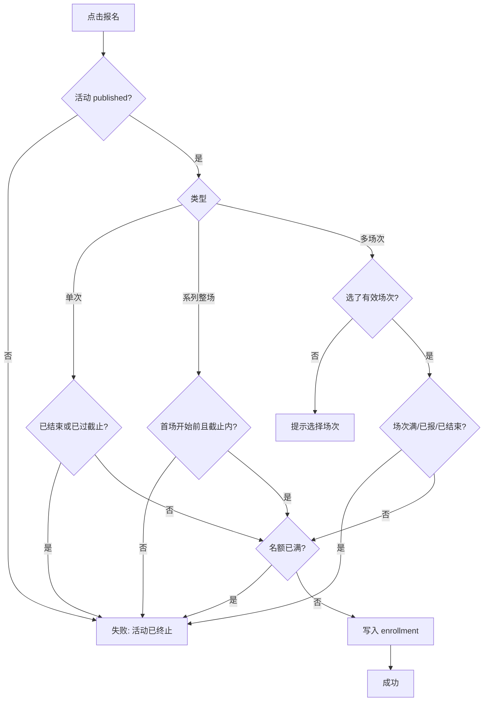
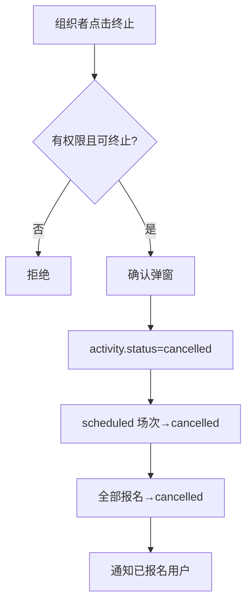

# EXP 兴趣小组产品需求文档（PRD）

| 属性 | 值 |
|------|-----|
| 文档版本 | v1.0 |
| 生成日期 | 2026-06-03 |
| 产品模块 | EXP 智能体 · 谋发展 · 兴趣小组 |
| 文档来源 | 基于 `site/` 原型与历史规格整理；部分章节仍保留旧 Vite 路由描述，**以实现为准见 `site/assets/`** |
| 适用范围 | C 端移动员工端 + PC 管理端均在 `site/` 离线原型（`cd site && node serve.mjs`） |

---

## 1. 项目背景、业务目的、量化业务指标

### 1.1 项目背景

企业员工缺乏低门槛、可发现的内部兴趣社群入口。活动信息分散在群聊与口头传播中，参与成本高。EXP 智能体在「谋发展」场景下提供**兴趣小组**模块，让员工可发现小组、报名活动、创建自发组，并通过规则引擎 + 对话助手降低信息检索成本。

### 1.2 业务目的

| 目的 | 说明 |
|------|------|
| 提升参与率 | 降低「找到合适活动」的路径长度 |
| 赋能员工自组织 | 自发组先上线后报备，减少审批阻塞 |
| 解耦加入与报名 | 员工可直接报名活动，不必先加入小组 |
| 可解释推荐 | 规则排序 + 理由文案，非黑盒 |
| 组织侧可运营 | 管理员身份可创建小组、发布/终止活动、查看运营指标 |

### 1.3 量化业务指标

> 当前为前端原型，以下指标为产品目标值；**代码中未接入真实埋点与统计后台**，基线待上线后采集。

| 指标 | 定义 | 目标（上线后 90 天） | 测量方式 |
|------|------|---------------------|----------|
| 模块激活率 | 登录员工中至少浏览过兴趣小组首页的比例 | ≥ 40% | 首页 PV / 可登录员工数 |
| 活动报名转化率 | 活动详情 UV 中完成至少 1 次报名的比例 | ≥ 25% | 报名成功事件 / 活动详情 UV |
| 7 日二次参与率 | 首次报名后 7 日内再次报名或加入小组的比例 | ≥ 15% | 用户行为序列 |
| 自发组创建数 | 每季度员工自发创建且保持 active 的小组数 | ≥ 20 个/季度 | 小组创建事件 |
| 报备完成率 | 自发组创建后 7 日内 `reportStatus=reported` 的比例 | ≥ 80% | 报备状态变更 |
| 活动满员率 | 已发布活动中达到 capacity 的比例 | 监控，不设硬目标 | 报名数 / capacity |
| 对话助手意图命中率 | 用户提问后未落入 `unknown` 意图的比例 | ≥ 70% | 意图分类日志 |

---

## 2. 目标用户画像与使用场景

### 2.1 用户角色

| 角色 | 系统标识 | 典型人物 | 核心动机 |
|------|----------|----------|----------|
| 普通员工 | `employee` | 产品专员小林，入职 1 年，想参加跑步/读书活动 | 快速找到活动并报名，偶尔浏览新小组 |
| 小组组织者（管理员身份） | `manager` | 摄影社组长阿杰，兼管小组活动 | 创建/编辑小组、发布活动、查看报名与运营待办 |
| 官方运营 | 数据层 `official` 组 | HR/工会运营（无 C 端创建入口） | 维护官方精品组，事后审阅自发组报备 |

> **身份切换**：首页右上角 `RoleIdentitySwitcher` 在「员工 / 管理员」间切换，状态存于本地 `localStorage`（`exp-app-role`）。组织类写操作（创建小组、发布活动、编辑/解散/终止、上传精彩瞬间）**须管理员身份**；点赞、评论等社交操作**须员工身份**（管理员身份下不可点赞、不可发帖）。

### 2.2 核心使用场景

| 编号 | 场景 | 触发 | 期望结果 |
|------|------|------|----------|
| S1 | 首页发现活动 | 打开兴趣小组首页 | 看到近期活动、推荐小组（员工）或运营统计（管理员） |
| S2 | 直接报名 | 活动详情点击报名 | 无需先加入小组即可报名成功 |
| S3 | 多场次选择报名 | 周期/系列按场次活动 | 在弹窗中多选最近 10 场内可选场次 |
| S4 | 创建自发组 | 管理员身份 → 创建小组 | 立即上线，展示 7 日报备 Banner |
| S5 | 发布活动 | 管理员身份 → 小组详情 → 发布活动 | 活动发布，创建人自动加入全部场次 |
| S6 | AI 对话查询 | 首页/对话页输入自然语言 | 返回小组/活动卡片或可执行动作（加入、报名） |
| S7 | 活动社交 | 活动详情评论区 | 发帖、回复、点赞、传图（最多 9 张） |
| S8 | 小组圈互动 | 小组详情「小组圈」Tab | 成员发动态、回复、点赞 |
| S9 | 终止活动 | 组织者终止周期/系列活动 | 活动下架，未举办场次取消，报名作废，通知已报名用户 |
| S10 | 沟通引擎通知 | 报名/发布/即将开始等 | 消息列表收到预览通知，可深链跳转 |

---

## 3. 需求范围（MoSCoW）与本期不实现

### 3.1 Must Have（已实现）

- 兴趣小组首页（推荐、近期活动、统计卡片、快捷入口、AI 输入栏）
- 小组广场 / 活动广场列表（搜索、筛选）
- 小组详情（活动 / 小组圈 / 精彩瞬间）
- 活动详情（单次 / 周期 / 系列，含多场次报名）
- 自发组创建、编辑、解散
- 活动创建、编辑、终止
- 加入 / 退出小组、报名 / 取消报名
- 自发组报备 Banner
- 规则引擎小组推荐 + 对话助手（关键词意图）
- AI 文案生成（小组简介、活动介绍，Mock）
- 活动评论、小组圈、点赞
- 精彩瞬间（管理员身份上传）
- 我的活动（我发布的 / 我报名的场次）
- 移动端管理列表（小组管理、活动管理）
- 沟通引擎通知（本地 Mock + 定时触发即将开始/已结束提醒）

### 3.2 Should Have（部分实现 / 原型级）

- 沟通引擎消息（本地存储，非真实 IM/推送）
- 管理员首页运营待办（待报备、零报名活动）
- 活动报名即将截止标签（距截止 ≤ 4 小时）

### 3.3 Could Have（设计有、代码未接入主应用）

- PC 管理后台（`/admin/interest-groups/*`，仅 `site/` 离线 Showcase）
- 真实 LLM 对接（当前为规则 Mock + 固定延迟 700ms）
- 向量语义推荐

### 3.4 Won't Have（本期明确不做）

| 功能 | 原因 |
|------|------|
| 搭子匹配 / 组队推荐 | 设计规格明确排除 |
| 兴趣小组内积分卡发放 | 由荣誉引擎负责 |
| 长期开放型活动（`ongoing`） | 类型未出现在当前代码枚举 |
| 活动签到 | 二期 backlog |
| 节假日场次顺延 | 二期 backlog |
| 真实 HR/组织架构对接 | 原型使用 Mock 员工数据 |
| C 端创建官方精品组 | 仅预置数据 |
| 创建时选择可见性（dept_only / invite_only） | 创建页固定 `public` |
| 成员角色管理（转让组长、设 admin） | MVP 不含 |
| 员工「我的兴趣标签」维护页 | 2026-06-03 已移除 |
| IM 实时推送 | 仅沟通引擎本地通知 Mock |

---

## 4. 产品名词、业务术语统一注释

| 术语 | 英文/字段 | 定义 |
|------|-----------|------|
| 兴趣小组 | InterestGroup | 员工围绕共同兴趣组成的社群单元 |
| 官方精品组 | `type=official` | 运营创建，推荐加权 +100 分 |
| 员工自发组 | `type=spontaneous` | 员工创建，需 7 日内工会/HR 报备 |
| 活动 | Activity | 小组下的一次参与单元，含单次/周期/系列 |
| 场次 | ActivityOccurrence | 周期/系列活动的具体一场时间实例 |
| 报名记录 | ActivityEnrollment | 员工与活动/场次的参与关系 |
| 整场报名 | `once_before_first` | 系列活动的报名方式：首场开始前报一次，参加全部场次 |
| 按场次报名 | `per_occurrence` | 系列/周期活动每场独立报名，可多选 |
| 报名截止 | enrollDeadline | 固定时间或「开始前 N 小时」 |
| 活动阶段 | 未开始 / 进行中 / 已结束 | 由当前时间与场次 startAt/endAt 计算 |
| 活动状态 | draft / published / cancelled | 原型发布即 published；终止为 cancelled |
| 小组可见性 | public / dept_only / invite_only | 控制谁可发现与查看 |
| 报备状态 | pending_report / reported / flagged | 仅自发组；flagged 为运营标记（原型未实现运营侧） |
| 沟通引擎 | Growth Engine | 应用内消息通知通道（Mock） |
| 小组圈 | GroupMoment | 小组成员图文动态，结构同评论 |
| 精彩瞬间 | GroupHighlight | 管理员按已结束场次上传的图片集 |
| 身份切换 | AppRole | employee=参与侧；manager=组织侧 |

---

## 5. 全模块通用全局规则

### 5.1 登录与身份

| 规则编号 | 规则 | 异常/提示 |
|----------|------|-----------|
| G-01 | 全站仅登录员工可访问（原型固定当前用户 `u1`） | 未登录跳转由宿主应用负责 |
| G-02 | 组织类写操作须 `manager` 身份 | Toast/页内文案：「仅管理员身份可{操作}」 |
| G-03 | 点赞、评论、小组圈发帖须 `employee` 身份 | 管理员身份下隐藏或禁用交互 |
| G-04 | 身份切换后首页快捷入口、统计卡片、推荐区块联动刷新 | 管理员不展示 AI 推荐小组 |

### 5.2 小组通用

| 规则编号 | 规则 | 异常/提示 |
|----------|------|-----------|
| G-05 | 小组成员上限 **100 人**（`GROUP_MEMBER_LIMIT`） | 「小组已满」/「小组已满员」 |
| G-06 | 已归档（`archived`）小组仅创建人/管理员可查看 | 「无法查看该小组」 |
| G-07 | 可见性：`public` 全员可见；`dept_only` 须员工 `deptId` 在 `deptIds` 内；`invite_only` 仅成员可见 | 非可见用户看不到列表与详情 |
| G-08 | 推荐池排除：非 active、已加入、本人创建、不可见 | 不出现在推荐列表 |
| G-09 | 自发组创建后立即 `active`，`reportStatus=pending_report`，`reportDueAt=创建日+7天` | 详情页展示报备 Banner |
| G-10 | 退出小组时自动取消该小组下全部活动报名 | 静默执行，无单独提示 |

### 5.3 活动通用

| 规则编号 | 规则 | 异常/提示 |
|----------|------|-----------|
| G-11 | **报名不要求先加入小组** | — |
| G-12 | 仅 `published` 活动可报名 | 终止活动：「活动已终止」 |
| G-13 | 发布活动后，创建人自动以 `organizerAuto` 加入全部未取消场次，跳过名额/截止限制 | — |
| G-14 | 活动/场次 `capacity` 满则不可新报名（已报名者除外） | 「名额已满」/「报名失败，可能已满或已截止」 |
| G-15 | 周期活动发布时生成 **4 条**未来场次 | — |
| G-16 | 多场次报名选择器展示最近 **10 场**未结束场次，超出显示 `beyondCount` 提示 | 「展示最近 10 场，可多选」 |
| G-17 | 已有其他用户报名后，组织者**不可修改**活动时间、场次、报名方式 | 编辑页顶部警告文案 |
| G-18 | 距报名截止 ≤ **4 小时**且未截止，展示「报名即将截止」标签 | — |
| G-19 | 兴趣小组模块**不发积分** | — |

### 5.4 内容与安全

| 规则编号 | 规则 | 异常/提示 |
|----------|------|-----------|
| G-20 | 图片上传仅接受 `image/*`，单张 ≤ **5MB** | 「请选择图片文件」/「图片不能超过 5MB」 |
| G-21 | 评论/动态图片最多 **9** 张 | 「最多上传 9 张图片」 |
| G-22 | 评论/动态须至少有文字或至少 1 张图 | 「发布失败，请填写内容或添加图片」 |
| G-23 | 仅作者可删除自己的评论/动态；删除顶层评论时级联删除回复 | 「删除失败」 |
| G-24 | 自定义标签 1–6 字，小组最多选 **3** 个标签 | 见字段清单 |

---

## 6. 分模块详细产品需求

### 6.1 兴趣小组首页

**路由**：`/agents/interest-groups`

| 维度 | 内容 |
|------|------|
| **前置条件** | 用户已登录；可切换员工/管理员身份 |
| **正常流程** | ① 进入首页 → ② 查看统计卡片（周期：本周/近30天/近90天）→ ③ 浏览近期活动或小组推荐 Tab → ④ 点击卡片进入详情 → ⑤ 底部 AI 输入栏可跳转对话或提交问题 |
| **异常场景** | 管理员身份：不展示小组推荐，展示运营统计与待办；近期活动为空时展示空状态；推荐为空时展示 `RecommendedGroupsEmptyState` |
| **交互说明** | 「换一批」偏移推荐列表；员工快捷入口：活动广场、小组广场、我的活动、我的小组；管理员：小组管理、活动管理、创建小组 |
| **验收标准** | ① 员工身份统计项为：已加入小组数、未开始活动数、周期内活动数，点击跳转对应列表 ② 管理员身份统计项为：发布活动数、周期场次数、周期报名数 ③ 有待报备或零报名时展示待办条 ④ 切换身份后快捷入口与 Feed 内容同步变化 ⑤ 进入首页触发沟通引擎定时检查（即将开始/已结束通知） |

---

### 6.2 小组广场（发现页）

**路由**：`/agents/interest-groups/discover`

| 维度 | 内容 |
|------|------|
| **前置条件** | 用户已登录 |
| **正常流程** | ① 浏览可见小组列表 → ② 可按标签分类筛选 → ③ 搜索名称/标签 → ④ 点击卡片进详情 → ⑤ 列表内可直接「加入」 |
| **异常场景** | 小组已满：Toast「小组已满」；invite_only 非成员不可见 |
| **交互说明** | 搜索实时过滤；标签分类来自 `tagCatalogFilterOptions` |
| **验收标准** | ① 仅展示 `canViewGroup=true` 且 `active` 的小组 ② 搜索匹配小组名或标签名 ③ 加入成功后 Toast「已加入「{name}」」且成员数 +1 |

---

### 6.3 小组详情

**路由**：`/agents/interest-groups/:groupId`

| 维度 | 内容 |
|------|------|
| **前置条件** | 小组存在且用户可见 |
| **正常流程** | ① 查看封面、简介、标签、成员数 → ② Tab 切换：活动 / 小组圈 / 精彩瞬间 → ③ 活动 Tab 可按类型筛选 → ④ 非成员点击「加入小组」→ ⑤ 管理员身份展示编辑/解散/发布活动 |
| **异常场景** | 不可见：「无法查看该小组」；已满非成员：「小组已满员」；invite_only 加入：Toast「邀请制小组，请联系组长」；已归档：隐藏加入/发布，保留查看 |
| **交互说明** | 自发组 pending_report 展示报备 Banner；成员可退出（组长不可退出，须解散）；点赞（员工身份）；成员列表 Sheet |
| **验收标准** | ① 报备 Banner 在 pending_report 时展示截止日与「我已报备」按钮，点击后 `reportStatus=reported` 且 Banner 消失 ② 加入/退出/解散链路符合 G-05/G-10 ③ 仅 `canOrganizeGroup`（管理员身份）见发布活动与编辑/解散 ④ 小组圈仅成员+员工身份可发帖 |

---

### 6.4 创建小组

**路由**：`/agents/interest-groups/new`

| 维度 | 内容 |
|------|------|
| **前置条件** | **管理员身份**（`InterestRoleGate`） |
| **正常流程** | ① 上传封面（必填）→ ② 可选上传头像 → ③ 填名称 → ④ 选标签（1–3）→ ⑤ AI 生成简介（可选）→ ⑥ 提交「创建并上线」→ 跳转小组详情 |
| **异常场景** | 非管理员：拦截页；缺名称/标签/封面：对应 Toast；标签超限：「最多选择 3 个标签」 |
| **交互说明** | 简介为空时默认「欢迎加入我们的兴趣小组！」；`visibility` 固定 public |
| **验收标准** | ① 提交后小组 `type=spontaneous, status=active, memberCount=1, ownerId=当前用户` ② 创建人自动 owner 成员 ③ 7 日报备 Banner 出现 ④ 创建成功后跳转详情页 |

---

### 6.5 编辑 / 解散小组

**路由**：`/agents/interest-groups/:groupId/edit`

| 维度 | 内容 |
|------|------|
| **前置条件** | 管理员身份 + 小组 active |
| **正常流程** | 修改名称、封面、标签、简介 → 保存 |
| **异常场景** | 无权限：「无法编辑该小组」；保存失败：「保存失败，请稍后重试」 |
| **解散流程** | 确认弹窗 → 小组 `archived` → 联动终止组内全部 published 活动 → 通知全部成员 |
| **验收标准** | ① 解散 Toast 含终止活动数量（若有） ② 解散后跳转小组管理列表 ③ 编辑字段校验同创建 |

---

### 6.6 活动广场 / 列表页

**路由**：`/agents/interest-groups/list/recent` 等

| 维度 | 内容 |
|------|------|
| **前置条件** | 已登录 |
| **正常流程** | 浏览近期活动卡片 → 日期筛选（全部/今天/本周/本月）→ 搜索 → 进入活动详情 |
| **异常场景** | 筛选无结果：「未找到相关活动」 |
| **交互说明** | 卡片以**活动**为维度，周期/系列不重复；时间文案为周期规则或「系列 · N 场 · 下一场 …」 |
| **验收标准** | ① 仅含仍有未结束场次的 published 活动 ② 按最近场次 startAt 排序 ③ URL 参数 `range=today|week|month` 生效 |

---

### 6.7 发布活动

**路由**：`/agents/interest-groups/:groupId/activities/new`

| 维度 | 内容 |
|------|------|
| **前置条件** | 管理员身份；小组存在且 active |
| **正常流程** | ① 选类型（单次/周期/系列）→ ② 填名称、介绍、地点、人数、封面 → ③ 配置时间与场次 → ④ 系列须选报名方式 → ⑤ 可选报名截止 → ⑥ AI 生成介绍 → ⑦ 发布 |
| **异常场景** | 见第 8 节字段校验；小组不存在：「小组不存在」 |
| **交互说明** | 切换类型时系列默认 1 个空场次；周期须选每周几或每月几号及时段 |
| **验收标准** | ① 发布后 `status=published` ② 创建人自动报名全部场次 ③ 通知小组其他成员（沟通引擎 `activity_published`）④ 周期生成 4 场次；系列按填写场次生成 |

---

### 6.8 活动详情与报名

**路由**：`/agents/interest-groups/activities/:activityId`

| 维度 | 内容 |
|------|------|
| **前置条件** | 活动存在；用户可见所属小组 |
| **正常流程（单次）** | 查看信息 → 点击报名 → 成功 Toast → 可取消报名 |
| **正常流程（系列整场）** | 首场开始前一次性报名 → 全部 scheduled 场次写入报名 |
| **正常流程（周期/系列按场）** | 打开场次选择 Sheet → 多选 → 确认 → 支持继续追加场次 |
| **异常场景** | 见下表 |

| 异常条件 | 用户提示 | 按钮状态 |
|----------|----------|----------|
| 活动已终止 | 「活动已终止」 | 不可报名 |
| 单次已结束 | 「活动已结束」 | 不可报名 |
| 已过报名截止 | 「已过报名截止时间」 | 不可报名 |
| 系列整场首场已开始 | 「首场已开始，本系列活动不再接受新报名」 | 不可报名 |
| 名额已满 | 按钮禁用 / 「报名失败…」 | 不可报名 |
| 多选未选场次 | 「请至少选择一个场次」 | — |
| 取消时未选 | 「请至少选择一个要取消的场次」 | — |
| 活动不存在 | 「活动不存在」 | — |

| **交互说明** | 展示组织者、点赞、评论；组织者管理员身份可编辑/终止；报名截止倒计时组件 `EnrollDeadlineMeta`；可查看场次报名人员 |
| **验收标准** | ① 非小组成员可报名 ② 系列整场 `once_before_first` 仅在首场开始前且未过截止可报 ③ 多场次报名后 `enrollCount` 同步 ④ 取消报名成功 Toast「已取消报名」⑤ 组织者终止后活动 cancelled、场次 scheduled→cancelled、报名作废并通知 |

---

### 6.9 编辑 / 终止活动

**路由**：详情页 `?edit=1` 或 `/activities/:activityId/edit`

| 维度 | 内容 |
|------|------|
| **前置条件** | 管理员身份 + 活动组织者（或平台管理员）；活动 published 且未结束 |
| **编辑限制** | 有他人报名时不可改时间/场次/报名方式 |
| **终止条件** | 周期/系列：随时可终止；单次：仅当已有他人报名 |
| **终止效果** | 活动 cancelled；scheduled 场次 cancelled；全部 enrolled 报名 cancelled；通知已报名用户 |
| **验收标准** | ① 终止确认文案含活动名 ② 成功 Toast「活动已终止…」③ 已终止不可再次终止 |

---

### 6.10 我的活动

**路由**：`/agents/interest-groups/my-activities`

| 维度 | 内容 |
|------|------|
| **前置条件** | 已登录 |
| **正常流程** | Tab：我发布的（仅管理员）/ 我报名的场次 → 阶段筛选（全部/未开始/进行中/已结束/已终止）→ 点击进详情 |
| **验收标准** | ① 我报名的按场次展开 ② 系列整场一条 enrollment 展开为多场次 ③ 组织者终止的活动展示「已终止」态 |

---

### 6.11 AI 对话助手

**路由**：`/agents/interest-groups/chat`

| 维度 | 内容 |
|------|------|
| **前置条件** | 已登录 |
| **支持意图** | recommend_group, recommend_activity, list_activity, group_detail, activity_detail, activity_schedule, my_groups, create_hint, create_activity_hint, join_guide, join_group_action, enroll_action, cancel_enrollment, terminate_activity, modify_activity, unknown |
| **正常流程** | 输入问题 → 解析意图 → 返回文本 + 卡片（最多预览 3 条，超出「查看更多」）→ 可卡片内直接加入/报名 |
| **异常场景** | unknown：引导澄清；报名失败：「可能已满或已截止」；非组织者终止：「仅活动创建人可终止活动」 |
| **验收标准** | ① 「推荐跑步小组」返回 scoredGroups ② 「这周有什么活动」按本周过滤 ③ 「帮我报名第一个」执行 enroll ④ 取消报名弹出确认卡片 ⑤ 卡片列表超过 3 条显示 overflow 跳转 |

---

### 6.12 活动评论

| 维度 | 内容 |
|------|------|
| **前置条件** | 员工身份；活动存在 |
| **正常流程** | 发帖（文字+图）→ 最新/最热排序 → 回复 → 点赞 → 删除自己的评论 |
| **异常** | 空内容：「发布失败，请稍后重试」；回复空：「回复失败，请稍后重试」 |
| **验收标准** | ① 顶层评论计入 activity.commentCount ② 回复不计入顶层数 ③ 删除顶层时级联删回复 |

---

### 6.13 小组圈

| 维度 | 内容 |
|------|------|
| **前置条件** | 小组成员 + 员工身份；小组未归档 |
| **规则** | 同评论：图文、回复、点赞、删除；结构复用 `ActivityCommentSection` |
| **验收标准** | 非成员不展示发帖入口；发布后 Toast「评论已发布」 |

---

### 6.14 精彩瞬间

| 维度 | 内容 |
|------|------|
| **前置条件** | 管理员身份 |
| **正常流程** | 选择已结束场次 → 上传图片+说明 → 展示在小组 Tab；可编辑/删除 |
| **异常** | 非管理员：`addGroupHighlight` 返回 null；无图：不可提交；同场次重复：不可重复上传 |
| **验收标准** | ① 仅 ended/completed 场次可选 ② 每场次最多 1 条 highlight ③ 删除成功 Toast「已删除」 |

---

### 6.15 移动端管理列表

**路由**：`/agents/interest-groups/admin/groups|activities`

| 维度 | 内容 |
|------|------|
| **前置条件** | 管理员身份（`InterestRoleGate`） |
| **小组管理** | 全部 active 小组；标签分类筛选；搜索 |
| **活动管理** | 即将开始活动；日期筛选；搜索 |
| **验收标准** | ① 非管理员不可进入 ② 空列表展示对应 empty 文案 |

---

### 6.16 沟通引擎通知

**入口**：`/manager/communication-engine`

| 事件类型 | 触发时机 | 预览文案模板 |
|----------|----------|--------------|
| activity_published | 小组发布新活动 | 「{小组}」发布了新活动「{活动}」，快来看看 |
| activity_enrolled | 有人报名 | 「{姓名}」报名了「{活动}」，当前共 N 人报名 |
| member_joined_group | 有人加入小组 | 「{姓名}」加入了「{小组}」… |
| activity_terminated | 活动终止 | 「{活动}」活动已终止，报名已作废 |
| group_disbanded | 小组解散 | 「{小组}」已解散，感谢你的参与 |
| activity_starting_soon | 开始前 1 小时 | 「{活动}」将在 1 小时后开始… |
| activity_ended_feedback | 场次结束后 | 「{活动}」已结束，欢迎留言… |

**验收标准**：每种事件仅触发一次（sent mark 去重）；通知含深链 `link` 字段。

---

## 7. 关键业务流程 Mermaid 流程图

### 7.1 员工参与活动主路径

### 7.2 自发组创建与报备

### 7.3 活动报名判定

### 7.4 活动终止

---

## 8. 页面字段清单

### 8.1 创建/编辑小组

| 字段 | 必填 | 校验规则 | 枚举/选项 | 默认值 |
|------|------|----------|-----------|--------|
| 小组封面 coverUrl | 是（创建） | 图片类型；≤5MB | — | — |
| 小组头像 avatarUrl | 否 | 同上 | — | 空 |
| 小组名称 name | 是 | 非空 trim | — | 空 |
| 标签 tagIds | 是 | 1–3 个 | 系统标签 + 自定义（自定义 1–6 字，category 默认「生活」） | [] |
| 简介 description | 否 | — | — | 空；提交默认「欢迎加入我们的兴趣小组！」 |
| 可见性 visibility | — | 创建固定 | `public` | public |
| 分类 category | — | 创建页无 UI；Mock 数据有 | 运动/文艺/生活/科技 | — |

### 8.2 发布/编辑活动

| 字段 | 必填 | 校验规则 | 枚举/选项 | 默认值 |
|------|------|----------|-----------|--------|
| 活动类型 activityKind | 是 | — | one_off / recurring / series | one_off |
| 活动名称 title | 是 | 非空 | — | 空 |
| 活动介绍 description | 是 | 非空 | — | 空 |
| 活动地点 location | 是 | 非空 | — | 空 |
| 人数上限 capacity | 是 | 正整数 | — | 20 |
| 活动封面 coverUrl | 是（发布） | 图片 ≤5MB | — | 空 |
| 单次时间 | 类型=单次时必填 | 结束 > 开始 | 日期+时段 | 空 |
| 周期 recurrence | 类型=周期时必填 | 选每周几或每月几号；结束时刻 > 开始 | weekly / monthly | weekly |
| 系列场次 | 类型=系列时必填 | ≥1 场；每场结束 > 开始 | — | 1 个空场次 |
| 系列报名方式 seriesEnrollmentMode | 类型=系列时必填 | — | once_before_first / per_occurrence | per_occurrence |
| 报名截止 enrollDeadline | 否 | 见 8.3 | none / fixed / hours_before_start | none |
| 状态 status | — | 发布即 published | draft/published/cancelled | published |

### 8.3 报名截止配置

| 模式 | 字段 | 校验 |
|------|------|------|
| 不限制 | mode=none | 清空截止字段 |
| 固定时间 | mode=fixed | 须先填活动时间；截止 < 活动开始；日期+时段必填 |
| 开始前 N 小时 | mode=hours_before_start | N 为正整数；N ≤ 720；预设 2/8/12/24 |

### 8.4 评论/小组圈

| 字段 | 必填 | 校验 | 默认 |
|------|------|------|------|
| content | 与图片二选一 | trim 后非空或有图 | 空 |
| imageUrls | 同上 | 最多 9 张；单张 ≤5MB | [] |

### 8.5 精彩瞬间

| 字段 | 必填 | 校验 | 默认 |
|------|------|------|------|
| occurrenceId | 是 | 须为已结束场次；同场次唯一 | — |
| imageUrls | 是 | ≥1 张 | — |
| caption | 否 | trim | 空 |

---

## 9. API 清单表格

> **说明**：当前 Vite 主应用为前端 Mock，无真实 HTTP 接口。下表为**产品接口契约**，由 `src/data/interestGroups.ts` 等数据层操作反推，供后端对接。统一前缀建议 `/api/v1/interest-groups`。业务异常码为产品语义码，非 HTTP 状态码。

### 9.1 小组

| 方法 | 地址 | 入参 | 返回字段 | 业务异常码 |
|------|------|------|----------|------------|
| GET | `/groups` | visibility, category, tag, q, page | items[]{id,name,type,category,visibility,tagIds,memberCount,status,...}, total | — |
| GET | `/groups/:groupId` | — | InterestGroupFull | IG404 小组不存在；IG403 不可见 |
| POST | `/groups` | name, description, coverUrl, avatarUrl?, tagIds | group | IG400 参数校验失败 |
| PATCH | `/groups/:groupId` | name, description, tagIds, coverUrl | group | IG403 无编辑权限；IG409 已归档 |
| POST | `/groups/:groupId/disband` | — | {group, terminatedActivityCount} | IG403 无权限 |
| POST | `/groups/:groupId/join` | — | {success, memberCount} | IG409 已满；IG409 已加入 |
| POST | `/groups/:groupId/leave` | — | {success} | IG403 组长不可退出；IG404 非成员 |
| POST | `/groups/:groupId/report` | — | {reportStatus} | IG404 |
| GET | `/groups/:groupId/members` | — | members[]{employeeId,name,role,...} | IG404 |
| GET | `/groups/recommend` | limit, offset | items[]{group,score,reasons[]} | — |

### 9.2 活动

| 方法 | 地址 | 入参 | 返回字段 | 业务异常码 |
|------|------|------|----------|------------|
| GET | `/activities` | groupId?, kind?, range?, q? | items[]{activity,group,timeLabel,...} | — |
| GET | `/activities/:activityId` | — | activity, group, occurrences[] | ACT404 |
| POST | `/groups/:groupId/activities` | 见 8.2 字段 + sessions[]? | activity, occurrences[] | ACT400 校验失败；IG403 无发布权限 |
| PATCH | `/activities/:activityId` | 可编辑字段 | activity | ACT403 无权限；ACT409 已有他人报名不可改场次 |
| POST | `/activities/:activityId/terminate` | — | activity | ACT403；ACT409 不可终止 |
| GET | `/activities/:activityId/enrollees` | occurrenceId | enrollees[] | ACT404 |

### 9.3 报名

| 方法 | 地址 | 入参 | 返回字段 | 业务异常码 |
|------|------|------|----------|------------|
| POST | `/activities/:activityId/enrollments` | occurrenceId? 或 occurrenceIds[] | enrollment(s) | ENR409 已满；ENR410 已截止；ENR411 首场已开始；ENR412 场次无效；ENR409 已报名 |
| DELETE | `/activities/:activityId/enrollments` | occurrenceId? | success | ENR404 无报名记录 |
| GET | `/me/enrollments` | role?, phase? | items[]{enrollment,activity,group,occurrence,terminated} | — |
| GET | `/me/organized-activities` | phase? | items[]{activity,group,occurrence} | — |

### 9.4 社交与内容

| 方法 | 地址 | 入参 | 返回 | 业务异常码 |
|------|------|------|------|------------|
| GET/POST | `/activities/:id/comments` | content, imageUrls[] | comment | CMT400 内容为空 |
| POST | `/comments/:id/replies` | content | reply | CMT400 |
| DELETE | `/comments/:id` | — | success | CMT403 非作者 |
| POST | `/comments/:id/like` | — | {liked, likeCount} | CMT404 |
| GET/POST | `/groups/:id/moments` | 同评论 | moment | 同上 |
| GET/POST/PATCH/DELETE | `/groups/:id/highlights` | activityId, occurrenceId, imageUrls, caption | highlight | HL403 非管理员；HL409 场次已有 |

### 9.5 AI 与通知

| 方法 | 地址 | 入参 | 返回 | 业务异常码 |
|------|------|------|------|------------|
| POST | `/ai/group-description` | name, tagIds | {description} | AI400 缺名称/标签 |
| POST | `/ai/activity-description` | title, activityKind, location?, groupName?, tagNames? | {description} | AI400 |
| POST | `/ai/chat` | message | {intent, text, cards?, suggestions[]} | — |
| GET | `/notifications/growth-engine` | — | notifications[] | — |

---

## 10. 埋点需求清单、非功能需求

### 10.1 埋点清单（代码未实现，建议上线前补齐）

| 事件名 | 触发时机 | 属性 |
|--------|----------|------|
| ig_home_view | 进入首页 | role, stats_period |
| ig_group_join | 加入成功 | group_id, group_type, source_page |
| ig_group_leave | 退出成功 | group_id |
| ig_group_create | 创建成功 | group_id, tag_ids |
| ig_group_disband | 解散成功 | group_id, terminated_activity_count |
| ig_activity_view | 活动详情 PV | activity_id, activity_kind, group_id |
| ig_activity_enroll | 报名成功 | activity_id, occurrence_ids[], enroll_mode |
| ig_activity_enroll_fail | 报名失败 | activity_id, reason_code |
| ig_activity_cancel | 取消报名 | activity_id, occurrence_ids[] |
| ig_activity_publish | 发布活动 | activity_id, activity_kind |
| ig_activity_terminate | 终止活动 | activity_id |
| ig_ai_chat_send | 发送对话 | intent, message_length |
| ig_ai_chat_action | 卡片内动作 | action: join/enroll |
| ig_comment_post | 评论/动态发布 | target_type, target_id, has_image |
| ig_report_mark | 点击我已报备 | group_id |
| ig_role_switch | 切换身份 | from_role, to_role |

### 10.2 性能需求

| 项 | 要求 |
|----|------|
| 首页首屏 | 移动 4G 下 ≤ 2s 可交互（生产环境） |
| 列表滚动 | 60fps，分页加载，单页 ≤ 20 条 |
| 图片 | 客户端压缩；封面建议 ≤ 5MB |
| 对话响应 | Mock ≤ 1s；接 LLM 后 P95 ≤ 3s |

### 10.3 兼容性需求

| 项 | 要求 |
|----|------|
| 浏览器 | iOS Safari 15+、Android Chrome 90+、微信内置浏览器 |
| 布局 | 移动优先 `max-w-md`；PC 浏览器可居中预览 |
| 离线 | 原型不承诺；生产需网络 |

### 10.4 安全与合规

| 项 | 要求 |
|----|------|
| 权限 | 组织/社交操作按身份分离校验 |
| 内容 | 仅作者可删自己的 UGC |
| 数据 | 员工信息遵循公司数据规范 |

---

## 11. 项目风险与上线注意事项

### 11.1 风险

| 风险 | 影响 | 缓解 |
|------|------|------|
| 身份切换为演示机制，非真实权限体系 | 生产环境权限失控 | 对接 SSO + 服务端 RBAC，移除 localStorage 角色切换 |
| Mock 数据无持久化后端 | 刷新/多端不同步 | 优先对接核心 CRUD 与报名 API |
| 对话助手为关键词 Mock | 意图命中率不稳定 | 上线前接 LLM + 意图评测集 |
| 管理员/员工能力割裂 | 组长需切换身份才能运营 | 评估合并为「组长角色」单一身份 |
| 报备仅前端标记 | 无法审计 | 二期接运营后台 + 工单 |
| PC 管理端未入主应用 | 运营无法正式使用 | 按 `exp-admin-pc` 规范接入 `/admin` 路由 |
| 沟通引擎为本地 Mock | 无真实触达 | 对接 IM/推送通道 |

### 11.2 上线注意事项

1. **数据迁移**：预置官方组、标签词典、示例活动需同步至生产种子数据。
2. **名额一致性**：`enrollCount` 须与 enrollment 记录服务端事务一致。
3. **时区**：所有时间 ISO 存储，展示用用户本地时区。
4. **终止活动**：须幂等；重复终止返回成功不二次通知。
5. **报名截止**：「即将截止」标签依赖客户端实时计算，服务端须为权威截止判定。
6. **图片存储**：当前 Base64 本地预览，生产须接对象存储 CDN。
7. **埋点**：第 10 节事件须在首版上线前完成接入，否则无法验证第 1 节指标。
8. **回归清单**：单次/周期/系列各 1 条端到端；整场 vs 按场报名；满员/截止/终止边界；dept_only 可见性；自发组报备 Banner。

---

*文档结束*
