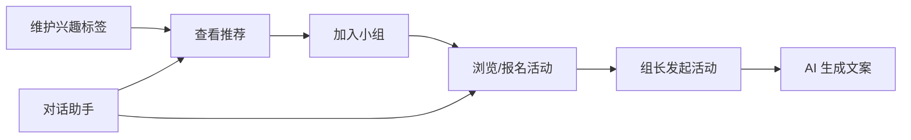

# 兴趣小组功能设计规格

**日期**：2026-05-26  
**状态**：已批准（2026-05-26）  
**项目**：EXP 智能体 / humanistic-care 前端原型  

---

## 1. 背景与目标

为企业员工提供**兴趣社群发现、加入与活动参与**能力，嵌入现有「谋发展 → 兴趣小组」智能体入口，与员工档案、同事查询模块数据一致。

### 1.1 成功标准（MVP）

- 员工可维护兴趣标签，系统能基于标签推荐未加入的小组与可报名活动。
- 支持官方精品组与员工自发组；自发组**先上线后报备**。
- 活动支持四种时间形态：单次、长期开放、固定周期、系列场次。
- AI 提供：智能推荐、活动文案生成、自然语言对话查询（不含搭子匹配）。

### 1.2 非目标（MVP 不做）

- 搭子匹配 / 组队推荐（E）。
- 向量检索、真实 HR 对接、**IM 消息推送**、签到、节假日顺延（列入二期，IM 见 §14.1）。
- **兴趣小组内积分卡发放**（见 §7.7；积分由荣誉引擎按场景配置，非每场活动必发）。

---

## 2. 需求决策摘要

| 议题 | 决策 |
|------|------|
| 兴趣标签来源 | 自填为主 + AI 后台补全（员工确认/忽略），默认不对同事展示；**与员工管理档案同源同步**（§7.6） |
| 小组治理 | 官方精品组 + 员工自发组；自发组**先上线后报备** |
| 活动形态 | A 单次 + B 长期开放 + C 固定周期 + D 系列场次 |
| AI 能力 | A 推荐 + C 文案生成 + D 对话助手（**不含 E 搭子匹配**） |
| 积分卡 | **本期不在兴趣小组模块发放**；由 **荣誉引擎** 按荣誉/赛事等场景配置（§7.7） |
| 可见性 | 全站仅登录员工；标签默认仅用于推荐；小组分 public / dept_only / invite_only |

---

## 3. 用户角色与旅程

### 3.1 角色

| 角色 | 能力 |
|------|------|
| 普通员工 | 维护标签、浏览/加入小组、报名活动；**可创建员工自发组**（§7.4） |
| 小组创建人（组长） | 自发组创建人即 owner；发布活动（§7.5）、编辑小组信息（MVP 暂不含成员管理） |
| 官方运营 | 创建官方精品组（无客户端入口）、标记推荐位、事后审阅自发组报备 |

### 3.2 核心旅程



**自发组创建旅程（先上线后报备）**：

1. 员工填写小组信息 → 立即 `active`，全员可按可见性规则发现。
2. 系统记录 `reportDueAt`（如创建后 7 日内）并提示「请向工会/HR 完成报备」。
3. 运营后台（或二期页面）可标记 `reported` / `flagged`；未报备仅提醒，不自动下架（除非运营处理）。

---

## 4. 领域模型

### 4.1 实体关系

```
Employee ──1:1── EmployeeInterestProfile
EmployeeInterestProfile ──*:*── InterestTag

InterestGroup ──*:*── InterestTag
InterestGroup ──1:*── GroupMembership ──*── Employee

InterestGroup ──1:*── Activity
Activity ──1:*── ActivityOccurrence   # 系列子场、周期展开实例
ActivityOccurrence ──1:*── ActivityEnrollment
```

### 4.2 实体字段（逻辑层）

#### EmployeeInterestProfile

| 字段 | 说明 |
|------|------|
| employeeId | 员工 ID |
| tags | `{ tagId, source, confidence?, confirmedAt? }[]` |
| source | `manual` \| `ai_suggested` \| `inferred` |
| updatedAt | 最后更新时间 |

- `manual`：员工主动选择，最高优先级。
- `ai_suggested`：AI 建议，需用户确认后才视为 manual。
- `inferred`：仅用于推荐，不在 UI 对他人展示。

#### InterestTag

| 字段 | 说明 |
|------|------|
| id, name, category | 如「运动 / 文艺 / 生活」 |
| synonyms | 可选，用于对话同义词 |

#### InterestGroup

| 字段 | 说明 |
|------|------|
| id, name, description, coverUrl? | 基本信息 |
| type | `official` \| `spontaneous` |
| visibility | `public` \| `dept_only` \| `invite_only` |
| deptIds? | `dept_only` 时限制的部门 |
| tagIds | 小组标签，用于推荐 |
| status | `active` \| `archived` |
| reportStatus? | 仅自发组：`pending_report` \| `reported` \| `flagged` |
| reportDueAt? | 报备截止时间 |
| memberCount | 冗余计数 |
| ownerId | 组长 |

#### Activity

| 字段 | 说明 |
|------|------|
| id, groupId, title, description | 基本信息 |
| activityKind | `one_off` \| `ongoing` \| `recurring` \| `series` |
| location?, capacity?, enrollDeadline? | 共用 |
| startAt?, endAt? | `one_off` 必填；`ongoing` 可无 endAt |
| rrule? | `recurring` 的 iCal RRULE 字符串 |
| seriesEnrollmentMode? | 仅 `series`：`once_before_first`（整场报名，首场前截止）\| `per_occurrence`（按场次报名） |
| seriesId? | 若为系列下的模板，指向父 `series` 活动 |
| status | `draft` \| `published` \| `cancelled` |

#### ActivityOccurrence

| 字段 | 说明 |
|------|------|
| id, activityId | 所属活动（周期规则或系列父级） |
| startAt, endAt | 本场时间 |
| capacity?, enrollCount | 本场限额 |
| status | `scheduled` \| `cancelled` \| `completed` |

- **单次**：可仅用 Activity，不强制 Occurrence；或统一为 1 条 Occurrence。
- **长期开放**：Activity `ongoing` + `enrollOpen=true`，无具体 Occurrence 或虚拟「常驻」Occurrence。
- **固定周期**：Activity `recurring` + `rrule`；系统生成未来 N 条 Occurrence。
- **系列**：父 Activity `series`；子 Occurrence 手动或批量创建；报名方式见 §7.8。

### 7.8 系列活动报名方式（2026-05-27）

发布系列活动时，创建人选择报名方式：

| 模式 | 字段值 | 适用场景 | 规则 |
|------|--------|----------|------|
| **整场报名** | `once_before_first` | 篮球赛初赛→晋级赛→决赛等赛程一体 | 仅**首场开始前**可报名；报一次视为参加**全部场次**；首场开始后**不接受**中途加入 |
| **按场次报名** | `per_occurrence` | AI 实践分享等各场相对独立 | 每场可单独报名；仅未结束的 scheduled 场次可报；可选具体场次 |

**默认（原型）**：`per_occurrence`。

**与 `enrollDeadline`**：整场报名模式下，活动级 `enrollDeadline` 与首场开始时间共同约束（以更早者为准）。

### 7.9 周期 / 系列按场次多选报名（2026-05-27）

| 活动类型 | 报名方式 | 场次选择 |
|----------|----------|----------|
| 每周 / 每月（`recurring`） | 按场次多选 | 展示未来场次，**近 3 个月内可选** |
| 系列 · 按场次（`per_occurrence`） | 按场次多选 | 同上 |
| 系列 · 整场（`once_before_first`） | 单次报名 | 不选场次 |

**时间窗**：以当前日为起点，**3 个月内**的未结束场次可勾选；更晚场次在列表底部灰色展示「仅开放近三个月内报名」，不可选。

**UX**：报名弹窗分区——近三个月可选（多选）、已报名、已满、更晚场次（暂不可选）；支持「继续报名」追加场次。

**记录日期**：2026-05-27

#### ActivityEnrollment

| 字段 | 说明 |
|------|------|
| occurrenceId? | 长期开放可仅关联 activityId |
| employeeId, enrolledAt, status | `enrolled` \| `cancelled` |

---

## 5. 推荐逻辑（规则引擎，MVP）

### 5.1 小组推荐

```
score(group) =
  Σ weight(tag) for tag in (employeeTags ∩ group.tagIds)
  + deptBonus        if group.visibility == dept_only && same dept
  + officialBonus    if group.type == official (可选常量)
  - joinedPenalty    if already member (exclude from list)
```

返回 Top N，附带**可解释理由**，例如：「与你标签 #跑步 #摄影 匹配」。

### 5.2 活动推荐

- 已加入小组的即将开始 Occurrence（按 startAt 升序）。
- 未加入但小组标签匹配且活动 `public` 可见的 Occurrence。
- 长期开放活动单独区块展示。

### 5.3 AI 标签补全（非独立 AI 功能）

- 触发：标签为空或少于 2 个时，在「我的兴趣」页展示建议 chips。
- 数据来源（原型 mock）：部门、已加入小组、skills 字段映射。
- 用户点击「添加」→ `source` 变为 `manual`；点击「忽略」→ 不再提示该 tag。

---

## 6. AI 能力规格

| ID | 能力 | 入口 | MVP 行为 |
|----|------|------|----------|
| A | 智能推荐 | 兴趣小组首页、小组详情页 | 规则打分 + 理由文案 |
| C | 内容生成 | 创建/编辑活动页 | 复用 `CareContentAiPanel`：一次 3 条，点击填入标题/描述 |
| D | 对话助手 | 兴趣小组 Agent 页底部输入 | 意图解析（mock 关键词）→ 返回小组/活动卡片列表 |

**明确排除**：E 搭子匹配（二期再评估）。

### 6.1 对话意图（MVP mock）

| 意图 | 示例 | 响应 |
|------|------|------|
| recommend_group | 「推荐跑步小组」 | 小组卡片列表 |
| list_activity | 「下周有什么活动」 | 按时间过滤的 Occurrence 卡片 |
| my_groups | 「我加入了哪些组」 | 当前用户 memberships |
| create_hint | 「怎么发起活动」 | 静态引导 + 跳转创建页 |

---

## 7. 权限与可见性

### 7.1 标签

- 仅本人与推荐服务可读写完整标签列表。
- 他人查看员工主页时：**不展示**兴趣标签，仅展示已加入的小组名称（与现 `EmployeeProfile` 一致）。

### 7.6 兴趣标签同步（我的兴趣 ↔ 员工管理）

**决策（2026-05-27，MVP）**：同一员工的兴趣标签在 **「我的兴趣」**（`/profile/interests`）与 **员工管理 / 员工档案**（`EmployeeFull.interestTagIds`）之间**保持双向同步**，共用一套读写 API。

| 入口 | 路径 / 字段 | 说明 |
|------|-------------|------|
| 我的兴趣 | `/profile/interests`、`interestProfileStore` | 员工自助维护标签 |
| 员工管理 / 档案 | `colleagueData` → `EmployeeFull.interestTagIds` | HR 或档案侧维护（原型为 mock 字段） |

**同步规则**：

| 规则 | 说明 |
|------|------|
| 单一事实来源 | `getProfileTags(employeeId)` / `setProfileTags(tags, employeeId)` |
| 读取顺序 | `localStorage`（`exp-interest-profile-{id}`）→ 员工档案 `interestTagIds` → 启发式默认 |
| 写入 | 同时更新 `localStorage` 与 `setEmployeeInterestTagIds()` |
| 可见性 | 同步不改变 §7.1：他人主页仍不展示标签，仅内部推荐使用 |
| 二期 | 对接 HR/员工主数据 API 后，由服务端保证一致性，前端去掉双写 |

**当前原型实现**：`interestProfileStore.ts` + `colleagueData.get/setEmployeeInterestTagIds`。

**记录日期**：2026-05-27

### 7.2 小组

| visibility | 发现 | 加入 |
|------------|------|------|
| public | 全公司搜索/推荐 | 直接申请或自动加入（可配置） |
| dept_only | 同部门员工 | 同部门或白名单 |
| invite_only | 不可搜索 | 仅邀请链接/二维码 |

### 7.3 活动

- 默认随小组可见性；活动可设 `members_only` 详情（MVP 可选，默认公开标题与时间）。

### 7.4 创建小组权限

**决策（2026-05-27，MVP 暂定）**：

| 小组类型 | 谁可以创建 | 客户端入口 |
|----------|------------|------------|
| **员工自发组**（`spontaneous`） | 任意已登录、可进入兴趣小组模块的员工 | 首页「创建小组」→ `/agents/interest-groups/new` |
| **官方精品组**（`official`） | 仅官方运营（后台 / 数据维护） | **无**创建入口，原型中仅预置数据 |

**自发组创建规则（MVP）**：

| 规则 | 说明 |
|------|------|
| 身份校验 | 使用当前登录用户 `CURRENT_EMPLOYEE_ID` 作为 `ownerId`，自动加入且 `role=owner` |
| 无额外门槛 | 不要求入职天数、兴趣标签数量、已加入其他小组等 |
| 无数量限制 | 不限制每人创建数或同时担任组长数（原型） |
| 上线与报备 | 提交后立即 `active`；`reportStatus=pending_report`，7 日内须完成工会/HR 报备（见 §11） |
| 固定字段 | `type=spontaneous`、`visibility=public`；可见范围选择已从创建页移除 |

**与发布活动的关系**：自发组创建人即小组 owner，享有 §7.5 所述「发布活动」权限。

**二期可扩展**：正式员工 / 白名单、每人组长上限、须完善标签、创建前审批、创建后运营审核才公开、`dept_only` / `invite_only` 可见范围。

**当前原型实现**：`GroupCreate` + `createSpontaneousGroup()`；路由无 `canCreateGroup` 校验。

**记录日期**：2026-05-27

### 7.5 发布活动权限

**决策（2026-05-27，MVP 暂定）**：**仅小组创建人**可发布活动。

| 规则 | 说明 |
|------|------|
| 发布主体 | `InterestGroup.ownerId` 与 `GroupMembership.role === "owner"` 的员工 |
| 普通成员 | 可加入、浏览、报名活动；**不可**见「发布活动」入口 |
| 官方 / 自发组 | 同一规则；官方组 `ownerId` 由运营指定，自发组创建人即 owner |
| 路由守卫 | `/agents/interest-groups/:groupId/activities/new` 非 owner 访问时提示并引导返回 |

**二期可扩展**：`admin` 角色代发、报备完成前置、活动审核流、组长转让后权限迁移。

**当前原型实现**：`isGroupOwner()`（`interestGroups.ts`）；`GroupDetail` 仅 owner 展示「发布活动」；`ActivityCreate` 页校验。

**记录日期**：2026-05-27

### 7.7 积分卡与荣誉引擎（本期不做活动内发放）

**决策（2026-05-27）**：兴趣小组模块 **本期不实现积分卡发放**（活动结束不自动发分、组长不可在创建/编辑活动时配置积分奖励）。

**原因**：

| 说明 |
|------|
| 兴趣小组活动类型多样，许多日常活动（例跑、读书分享、内部交流）**无需也不应**绑定积分激励 |
| 积分更适合与 **荣誉、赛事结果、公司级表彰** 等明确规则挂钩，而非默认「每场活动都发」 |

**积分发放归属**：由 **荣誉引擎**（Honor Engine）统一配置与发放，与兴趣小组解耦。示例：

- 公司篮球赛 **冠军队** 队员每人获得 **100 积分**
- 其他荣誉规则（勋章、称号、榜单）同样在荣誉引擎侧定义，可按人/队/事件触发

**兴趣小组与荣誉引擎的关系（本期）**：

| 范围 | 本期 |
|------|------|
| 兴趣小组 | 发现、加入、报名、活动参与；**无**积分卡 UI、无发分 API |
| 荣誉引擎 | 独立模块；按运营/规则配置向指定人群发放积分 |
| 数据关联（可选、二期） | 活动 ID / 小组 ID 可作为荣誉规则的事件来源，**不强制**每场活动配置积分 |

**二期可评估**：活动结束后由运营在荣誉引擎绑定规则、或「官方精品活动 + 白名单」才展示积分说明；仍不建议默认全员活动自动发分。

**记录日期**：2026-05-27

---

## 8. 信息架构与路由

在现有 `App.tsx` 路由风格下新增：

| 页面 | 路径 |
|------|------|
| 兴趣小组首页 | `/agents/interest-groups` |
| 小组详情 | `/agents/interest-groups/:groupId` |
| 创建小组 | `/agents/interest-groups/new` |
| 活动详情 | `/agents/interest-groups/activities/:activityId` |
| 创建活动 | `/agents/interest-groups/:groupId/activities/new` |
| 我的兴趣标签 | `/profile/interests`（或 `EmployeeProfile` 内嵌入口） |

**入口**：

- `agents.ts` → `dev-interest-group` 跳转至首页。
- 首页 `SuggestedQuestions` 已有「如何加入兴趣小组？」可链至本模块。
- `EmployeeProfile` / `EmployeeDetail` 小组区块链至小组详情。

---

## 9. UI 模块（原型）

| 模块 | 说明 |
|------|------|
| InterestGroupHome | 推荐小组、我的小组（随机 2 个）、近期活动；见 §9.1 |
| InterestTagEditor | 标签选择 + AI 建议 chips |
| GroupDetail | 介绍、成员数、活动 Tab、加入按钮；**仅创建人**可见「发布活动」 |
| GroupCreateForm | 任意登录员工可建自发组；标签（含自定义输入）、报备提示条；可见范围 MVP 已去掉 |
| ActivityList | 按 kind 筛选 |
| ActivityCreateForm | 单页：选类型 + 表单 + AI 文案面板 |
| ActivityDetail | 时间、地点、报名、场次列表（系列/周期） |
| InterestGroupAgent | 对话 + 结果卡片（仿 `ColleagueAgent` / `HumanityCare`） |

视觉与交互遵循现有：`max-w-md` 移动布局、`shadow-soft`、`CareContentAiPanel` 模式。  
**悦文化/EXP C 端惯例**见 [`2026-05-26-exp-yueculture-app-ui-style.md`](./2026-05-26-exp-yueculture-app-ui-style.md)（卡片化、底部 AI、活动卡片字段、列表布局模式等）。

### 9.1 首页区块展示规则（MVP）

| 区块 | 规则 |
|------|------|
| **我的小组** | 每次进入首页，从当前用户已加入小组中**随机展示 2 个**；不足 2 个则全部展示；「查看更多」→ `/agents/interest-groups/list/my-groups` 看完整列表 |
| **近期活动** | **以活动（Activity）为维度**展示卡片，不按场次重复；周期 / 系列活动只占 1 张卡；**不展示已结束场次日期**；时间文案为周期规则（如「每周三 19:00」）或「系列 · N 场 · 下一场 …」；首页预览 2 条，列表页支持日期筛选 |
| AI 推荐 | 规则推荐 + 「换一批」偏移刷新 |

**近期活动列表逻辑（原型 `getRecentActivities`）**：

- 仅包含仍有未结束场次的已发布活动（`endAt >= now`）。
- 同一 `activityId` 仅一条；排序按「下一场未结束场次」的 `startAt`。
- 单次活动：展示活动起止时间；周期：展示 RRULE 摘要；系列：展示场次数 + 下一场时间（不罗列历史场次）。

**记录日期**：2026-05-27

---

## 10. 数据与存储（原型）

- 新建 `src/data/interestGroups.ts`：小组池、活动、Occurrence、标签词典。
- 新建 `src/data/interestProfileStore.ts`：按 `employeeId` 读写标签；`localStorage` 与员工档案 `interestTagIds` 双写同步（§7.6）。
- 扩展 `EmployeeFull`：`interestTagIds` 与「我的兴趣」同源；他人视角仍不展示标签；`interestGroups` 保留为已加入列表。
- 推荐与对话逻辑放 `src/lib/interestRecommend.ts`、`src/lib/interestAgent.ts`。

---

## 11. 自发组报备（先上线后报备）

| 阶段 | 行为 |
|------|------|
| 创建完成 | `status=active`，`reportStatus=pending_report`，`reportDueAt=now+7d` |
| 用户侧 | 小组详情顶部 Banner：「请在 x 日前完成工会报备」+ 「我已报备」按钮 |
| 点击已报备 | `reportStatus=reported`，Banner 消失 |
| 运营侧（二期） | 列表筛 `pending_report` / `flagged`，可下架或联系组长 |

MVP 不实现运营后台，仅员工侧 Banner + 状态字段。

---

## 12. 错误与边界

| 场景 | 处理 |
|------|------|
| 活动已满 | 报名按钮禁用，提示已满 |
| 周期场次已取消 | Occurrence `cancelled`，列表灰显 |
| 加入 invite_only 无邀请 | 提示联系组长 |
| 标签为空 | 推荐降级为「热门官方组」，并引导完善标签 |
| AI 文案生成失败 | Toast + 可手动输入 |

---

## 13. 测试要点（实现阶段）

- [ ] 标签增删改后推荐列表变化符合打分逻辑。
- [ ] 四种 activityKind 创建表单字段互斥正确。
- [ ] 周期活动生成至少 4 条未来 Occurrence。
- [ ] 自发组创建后立即可搜，报备 Banner 显示/消失正确。
- [ ] 对话 mock 覆盖 recommend_group、list_activity。
- [ ] dept_only 小组对非同部门员工不可见。
- [ ] 他人主页不展示兴趣标签。

---

## 14. 二期 backlog

### 14.1 IM 消息对接（后续迭代）

MVP 不在兴趣小组模块内实现 IM；后续可对接 EXP **IM 沟通引擎**（对齐悦文化 IM 规范：会话列表、卡片消息、深链跳转）。

**建议推送节点**：

| 节点 | 说明 | 跳转 |
|------|------|------|
| 活动报名成功 | 活动名、场次时间、地点 | 活动详情 |
| 活动即将开始 | 开始前 N 小时提醒（可配置） | 活动详情 |
| 取消报名 | 确认已取消及场次信息 | 活动详情 / 我的活动 |
| 加入小组 | 欢迎语、小组名称 | 小组详情 |
| 自发组报备提醒 | 创建后临近 `reportDueAt` | 小组详情 |
| 系列场次变更 | 某场 `Occurrence` 取消或改期 | 活动详情 |

**实现要点（二期）**：

- 消息体携带 `groupId` / `activityId` / `occurrenceId`，客户端统一解析深链。
- 小组群聊（可选）：加入小组后可选进入 IM 群，活动通知同步群内。
- 与现有 `ActivityEnrollment`、自发组 `reportDueAt` 等状态变更事件挂钩，由后端或消息服务异步下发。

### 14.2 其他

- 兴趣小组与荣誉引擎联动：活动/小组作为荣誉规则事件源；仍 **非** 默认每场活动发积分（见 §7.7）。
- 搭子匹配（E）：同活动报名者筛选与推荐。
- 向量语义推荐、真实 LLM 接入。
- 运营审阅后台、应用内推送（非 IM 通道）、签到、节假日顺延。
- 与企微/钉钉日历同步。

---

## 15. 修订记录

| 日期 | 变更 |
|------|------|
| 2026-05-26 | 初稿：需求对齐、混合推荐方案、ABCD 活动、ACDE→ACD AI |
| 2026-05-26 | 自发组改为先上线后报备；移除搭子匹配（E） |
| 2026-05-26 | 记录待决问题：谁可以创建小组（§7.4）；创建页去掉可见范围、标签支持自定义 |
| 2026-05-26 | 发布活动改为单页完成（不再分两步向导） |
| 2026-05-26 | 小组成员统一上限 100 人；记录待决问题：谁可以发布活动（§7.5） |
| 2026-05-26 | 二期 backlog 补充 IM 消息对接方案（§14.1）：报名/提醒/报备等推送节点与深链约定 |
| 2026-05-27 | §7.5 定稿：仅小组创建人可发布活动；原型增加 `isGroupOwner` 与页面校验 |
| 2026-05-27 | §7.4 定稿：登录员工可建自发组；官方组仅运营、无客户端创建入口 |
| 2026-05-27 | 本期 UI 不展示官方/自发标签；数据层 `type` 字段保留供二期与报备逻辑使用 |
| 2026-05-27 | §7.6 定稿：我的兴趣标签与员工档案 `interestTagIds` 双向同步 |
| 2026-05-27 | §9.1：首页「我的小组」每次进入随机展示 2 个已加入小组 |
| 2026-05-27 | §9.1：近期活动按活动维度去重，过滤已结束场次，周期/系列不重复卡片 |
| 2026-05-27 | §7.7：本期不做兴趣小组内积分卡发放；积分由荣誉引擎按荣誉/赛事等场景发放（如篮球赛冠军队每人 100 分） |
| 2026-05-27 | §7.8：系列活动支持「整场报名 / 按场次报名」；原型 `seriesEnrollmentMode` + 发布页选项 |
| 2026-05-27 | §7.9：周期/系列按场次多选报名，近 3 个月可选、更晚场次友好提示 |
