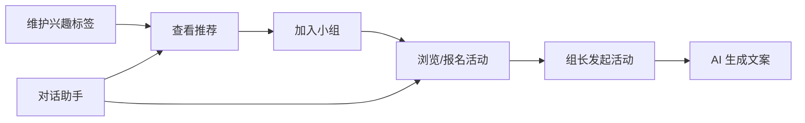

# 兴趣小组功能设计规格

**日期**：2026-05-26  
**状态**：已批准（2026-05-26）  
**项目**：EXP 智能体 / humanistic-care 前端原型  

---

## 1. 背景与目标

为企业员工提供**兴趣社群发现、加入与活动参与**能力，嵌入现有「谋发展 → 兴趣小组」智能体入口，与员工档案、同事查询模块数据一致。

### 1.1 成功标准（MVP）

- 员工可维护兴趣标签，系统能基于标签推荐未加入的小组与可报名活动。
- 支持官方精品组与员工自发组；自发组**先上线后报备**。
- 活动支持四种时间形态：单次、长期开放、固定周期、系列场次。
- AI 提供：智能推荐、活动文案生成、自然语言对话查询（不含搭子匹配）。

### 1.2 非目标（MVP 不做）

- 搭子匹配 / 组队推荐（E）。
- 向量检索、真实 HR 对接、**IM 消息推送**、签到、节假日顺延（列入二期，IM 见 §14.1）。

---

## 2. 需求决策摘要

| 议题 | 决策 |
|------|------|
| 兴趣标签来源 | 自填为主 + AI 后台补全（员工确认/忽略），默认不对同事展示 |
| 小组治理 | 官方精品组 + 员工自发组；自发组**先上线后报备** |
| 活动形态 | A 单次 + B 长期开放 + C 固定周期 + D 系列场次 |
| AI 能力 | A 推荐 + C 文案生成 + D 对话助手（**不含 E 搭子匹配**） |
| 可见性 | 全站仅登录员工；标签默认仅用于推荐；小组分 public / dept_only / invite_only |

---

## 3. 用户角色与旅程

### 3.1 角色

| 角色 | 能力 |
|------|------|
| 普通员工 | 维护标签、浏览/加入小组、报名活动、发起自发组与活动 |
| 组长 / 管理员 | 管理成员、发布活动、编辑小组信息 |
| 官方运营 | 创建官方精品组、标记推荐位、事后审阅自发组报备 |

### 3.2 核心旅程



**自发组创建旅程（先上线后报备）**：

1. 员工填写小组信息 → 立即 `active`，全员可按可见性规则发现。
2. 系统记录 `reportDueAt`（如创建后 7 日内）并提示「请向工会/HR 完成报备」。
3. 运营后台（或二期页面）可标记 `reported` / `flagged`；未报备仅提醒，不自动下架（除非运营处理）。

---

## 4. 领域模型

### 4.1 实体关系

```
Employee ──1:1── EmployeeInterestProfile
EmployeeInterestProfile ──*:*── InterestTag

InterestGroup ──*:*── InterestTag
InterestGroup ──1:*── GroupMembership ──*── Employee

InterestGroup ──1:*── Activity
Activity ──1:*── ActivityOccurrence   # 系列子场、周期展开实例
ActivityOccurrence ──1:*── ActivityEnrollment
```

### 4.2 实体字段（逻辑层）

#### EmployeeInterestProfile

| 字段 | 说明 |
|------|------|
| employeeId | 员工 ID |
| tags | `{ tagId, source, confidence?, confirmedAt? }[]` |
| source | `manual` \| `ai_suggested` \| `inferred` |
| updatedAt | 最后更新时间 |

- `manual`：员工主动选择，最高优先级。
- `ai_suggested`：AI 建议，需用户确认后才视为 manual。
- `inferred`：仅用于推荐，不在 UI 对他人展示。

#### InterestTag

| 字段 | 说明 |
|------|------|
| id, name, category | 如「运动 / 文艺 / 生活」 |
| synonyms | 可选，用于对话同义词 |

#### InterestGroup

| 字段 | 说明 |
|------|------|
| id, name, description, coverUrl? | 基本信息 |
| type | `official` \| `spontaneous` |
| visibility | `public` \| `dept_only` \| `invite_only` |
| deptIds? | `dept_only` 时限制的部门 |
| tagIds | 小组标签，用于推荐 |
| status | `active` \| `archived` |
| reportStatus? | 仅自发组：`pending_report` \| `reported` \| `flagged` |
| reportDueAt? | 报备截止时间 |
| memberCount | 冗余计数 |
| ownerId | 组长 |

#### Activity

| 字段 | 说明 |
|------|------|
| id, groupId, title, description | 基本信息 |
| activityKind | `one_off` \| `ongoing` \| `recurring` \| `series` |
| location?, capacity?, enrollDeadline? | 共用 |
| startAt?, endAt? | `one_off` 必填；`ongoing` 可无 endAt |
| rrule? | `recurring` 的 iCal RRULE 字符串 |
| seriesId? | 若为系列下的模板，指向父 `series` 活动 |
| status | `draft` \| `published` \| `cancelled` |

#### ActivityOccurrence

| 字段 | 说明 |
|------|------|
| id, activityId | 所属活动（周期规则或系列父级） |
| startAt, endAt | 本场时间 |
| capacity?, enrollCount | 本场限额 |
| status | `scheduled` \| `cancelled` \| `completed` |

- **单次**：可仅用 Activity，不强制 Occurrence；或统一为 1 条 Occurrence。
- **长期开放**：Activity `ongoing` + `enrollOpen=true`，无具体 Occurrence 或虚拟「常驻」Occurrence。
- **固定周期**：Activity `recurring` + `rrule`；系统生成未来 N 条 Occurrence。
- **系列**：父 Activity `series`；子 Occurrence 手动或批量创建。

#### ActivityEnrollment

| 字段 | 说明 |
|------|------|
| occurrenceId? | 长期开放可仅关联 activityId |
| employeeId, enrolledAt, status | `enrolled` \| `cancelled` |

---

## 5. 推荐逻辑（规则引擎，MVP）

### 5.1 小组推荐

```
score(group) =
  Σ weight(tag) for tag in (employeeTags ∩ group.tagIds)
  + deptBonus        if group.visibility == dept_only && same dept
  + officialBonus    if group.type == official (可选常量)
  - joinedPenalty    if already member (exclude from list)
```

返回 Top N，附带**可解释理由**，例如：「与你标签 #跑步 #摄影 匹配」。

### 5.2 活动推荐

- 已加入小组的即将开始 Occurrence（按 startAt 升序）。
- 未加入但小组标签匹配且活动 `public` 可见的 Occurrence。
- 长期开放活动单独区块展示。

### 5.3 AI 标签补全（非独立 AI 功能）

- 触发：标签为空或少于 2 个时，在「我的兴趣」页展示建议 chips。
- 数据来源（原型 mock）：部门、已加入小组、skills 字段映射。
- 用户点击「添加」→ `source` 变为 `manual`；点击「忽略」→ 不再提示该 tag。

---

## 6. AI 能力规格

| ID | 能力 | 入口 | MVP 行为 |
|----|------|------|----------|
| A | 智能推荐 | 兴趣小组首页、小组详情页 | 规则打分 + 理由文案 |
| C | 内容生成 | 创建/编辑活动页 | 复用 `CareContentAiPanel`：一次 3 条，点击填入标题/描述 |
| D | 对话助手 | 兴趣小组 Agent 页底部输入 | 意图解析（mock 关键词）→ 返回小组/活动卡片列表 |

**明确排除**：E 搭子匹配（二期再评估）。

### 6.1 对话意图（MVP mock）

| 意图 | 示例 | 响应 |
|------|------|------|
| recommend_group | 「推荐跑步小组」 | 小组卡片列表 |
| list_activity | 「下周有什么活动」 | 按时间过滤的 Occurrence 卡片 |
| my_groups | 「我加入了哪些组」 | 当前用户 memberships |
| create_hint | 「怎么发起活动」 | 静态引导 + 跳转创建页 |

---

## 7. 权限与可见性

### 7.1 标签

- 仅本人与推荐服务可读写完整标签列表。
- 他人查看员工主页时：**不展示**兴趣标签，仅展示已加入的小组名称（与现 `EmployeeProfile` 一致）。

### 7.2 小组

| visibility | 发现 | 加入 |
|------------|------|------|
| public | 全公司搜索/推荐 | 直接申请或自动加入（可配置） |
| dept_only | 同部门员工 | 同部门或白名单 |
| invite_only | 不可搜索 | 仅邀请链接/二维码 |

### 7.3 活动

- 默认随小组可见性；活动可设 `members_only` 详情（MVP 可选，默认公开标题与时间）。

### 7.4 创建小组权限（待决）

> **开放问题**：谁可以创建小组？

规格初稿中「普通员工」具备「发起自发组」能力，但**未明确**以下边界，需与 HR / 工会 / 运营对齐后定稿：

| 待确认项 | 可选方向（示例） |
|----------|------------------|
| 创建主体 | 全员 / 正式员工 / 入职满 N 天 / 白名单岗位 |
| 数量限制 | 每人同时担任组长上限、每月创建次数 |
| 前置条件 | 是否须先完善兴趣标签、是否须已加入至少 1 个小组 |
| 审批模式 | 先上线后报备（当前） vs 创建前审批 vs 创建后运营审核才公开 |
| 与官方组 | 仅运营可建 `official`；自发组 `spontaneous` 权限是否更严 |

**当前原型（2026-05-26）**：任意进入兴趣小组模块的用户均可从首页「创建小组」进入表单并提交；无角色校验、无次数限制；创建后固定 `type=spontaneous`、`visibility=public`（创建页已去掉可见范围选择）。

**记录日期**：2026-05-26

### 7.5 发布活动权限（待决）

> **开放问题**：谁可以发布活动？仅小组创建人（组长），还是任意成员？

规格初稿中「组长 / 管理员」具备发布活动能力，但**未明确**普通成员是否也可发活动，需与运营 / 工会对齐后定稿：

| 待确认项 | 可选方向（示例） |
|----------|------------------|
| 发布主体 | 仅 `owner` / `owner` + `admin` / 任意已加入成员 |
| 与小组类型 | 官方精品组是否仅运营或指定管理员可发；自发组是否更宽松 |
| 前置条件 | 是否须先完成小组报备（`reportStatus=reported`）才可发活动 |
| 审批模式 | 即发即公开 vs 组长审核后发布 vs 运营审核 |
| 与创建小组 | 创建人自动获得发布权；后续转让组长时权限如何迁移 |

**当前原型（2026-05-26）**：小组详情页中，**任意已加入成员**可见「发布活动」并进入创建页；路由 `/agents/interest-groups/:groupId/activities/new` 无角色校验；未加入用户不可见该入口。

**记录日期**：2026-05-26

---

## 8. 信息架构与路由

在现有 `App.tsx` 路由风格下新增：

| 页面 | 路径 |
|------|------|
| 兴趣小组首页 | `/agents/interest-groups` |
| 小组详情 | `/agents/interest-groups/:groupId` |
| 创建小组 | `/agents/interest-groups/new` |
| 活动详情 | `/agents/interest-groups/activities/:activityId` |
| 创建活动 | `/agents/interest-groups/:groupId/activities/new` |
| 我的兴趣标签 | `/profile/interests`（或 `EmployeeProfile` 内嵌入口） |

**入口**：

- `agents.ts` → `dev-interest-group` 跳转至首页。
- 首页 `SuggestedQuestions` 已有「如何加入兴趣小组？」可链至本模块。
- `EmployeeProfile` / `EmployeeDetail` 小组区块链至小组详情。

---

## 9. UI 模块（原型）

| 模块 | 说明 |
|------|------|
| InterestGroupHome | 推荐小组、我的小组、近期活动、长期招募 |
| InterestTagEditor | 标签选择 + AI 建议 chips |
| GroupDetail | 介绍、成员数、活动 Tab、加入按钮 |
| GroupCreateForm | 类型（自发）、标签（含自定义输入）、报备提示条；可见范围 MVP 已去掉 |
| ActivityList | 按 kind 筛选 |
| ActivityCreateForm | 单页：选类型 + 表单 + AI 文案面板 |
| ActivityDetail | 时间、地点、报名、场次列表（系列/周期） |
| InterestGroupAgent | 对话 + 结果卡片（仿 `ColleagueAgent` / `HumanityCare`） |

视觉与交互遵循现有：`max-w-md` 移动布局、`shadow-soft`、`CareContentAiPanel` 模式。  
**悦文化/EXP C 端惯例**见 [`2026-05-26-exp-yueculture-app-ui-style.md`](./2026-05-26-exp-yueculture-app-ui-style.md)（卡片化、底部 AI、活动卡片字段、列表布局模式等）。

---

## 10. 数据与存储（原型）

- 新建 `src/data/interestGroups.ts`：小组池、活动、Occurrence、标签词典。
- 新建 `src/data/interestProfileStore.ts`：当前用户标签（`localStorage` 持久化）。
- 扩展 `EmployeeFull`：不在他人视角暴露 tags；`interestGroups` 保留为已加入列表。
- 推荐与对话逻辑放 `src/lib/interestRecommend.ts`、`src/lib/interestAgent.ts`。

---

## 11. 自发组报备（先上线后报备）

| 阶段 | 行为 |
|------|------|
| 创建完成 | `status=active`，`reportStatus=pending_report`，`reportDueAt=now+7d` |
| 用户侧 | 小组详情顶部 Banner：「请在 x 日前完成工会报备」+ 「我已报备」按钮 |
| 点击已报备 | `reportStatus=reported`，Banner 消失 |
| 运营侧（二期） | 列表筛 `pending_report` / `flagged`，可下架或联系组长 |

MVP 不实现运营后台，仅员工侧 Banner + 状态字段。

---

## 12. 错误与边界

| 场景 | 处理 |
|------|------|
| 活动已满 | 报名按钮禁用，提示已满 |
| 周期场次已取消 | Occurrence `cancelled`，列表灰显 |
| 加入 invite_only 无邀请 | 提示联系组长 |
| 标签为空 | 推荐降级为「热门官方组」，并引导完善标签 |
| AI 文案生成失败 | Toast + 可手动输入 |

---

## 13. 测试要点（实现阶段）

- [ ] 标签增删改后推荐列表变化符合打分逻辑。
- [ ] 四种 activityKind 创建表单字段互斥正确。
- [ ] 周期活动生成至少 4 条未来 Occurrence。
- [ ] 自发组创建后立即可搜，报备 Banner 显示/消失正确。
- [ ] 对话 mock 覆盖 recommend_group、list_activity。
- [ ] dept_only 小组对非同部门员工不可见。
- [ ] 他人主页不展示兴趣标签。

---

## 14. 二期 backlog

### 14.1 IM 消息对接（后续迭代）

MVP 不在兴趣小组模块内实现 IM；后续可对接 EXP **IM 沟通引擎**（对齐悦文化 IM 规范：会话列表、卡片消息、深链跳转）。

**建议推送节点**：

| 节点 | 说明 | 跳转 |
|------|------|------|
| 活动报名成功 | 活动名、场次时间、地点 | 活动详情 |
| 活动即将开始 | 开始前 N 小时提醒（可配置） | 活动详情 |
| 取消报名 | 确认已取消及场次信息 | 活动详情 / 我的活动 |
| 加入小组 | 欢迎语、小组名称 | 小组详情 |
| 自发组报备提醒 | 创建后临近 `reportDueAt` | 小组详情 |
| 系列场次变更 | 某场 `Occurrence` 取消或改期 | 活动详情 |

**实现要点（二期）**：

- 消息体携带 `groupId` / `activityId` / `occurrenceId`，客户端统一解析深链。
- 小组群聊（可选）：加入小组后可选进入 IM 群，活动通知同步群内。
- 与现有 `ActivityEnrollment`、自发组 `reportDueAt` 等状态变更事件挂钩，由后端或消息服务异步下发。

### 14.2 其他

- 搭子匹配（E）：同活动报名者筛选与推荐。
- 向量语义推荐、真实 LLM 接入。
- 运营审阅后台、应用内推送（非 IM 通道）、签到、节假日顺延。
- 与企微/钉钉日历同步。

---

## 15. 修订记录

| 日期 | 变更 |
|------|------|
| 2026-05-26 | 初稿：需求对齐、混合推荐方案、ABCD 活动、ACDE→ACD AI |
| 2026-05-26 | 自发组改为先上线后报备；移除搭子匹配（E） |
| 2026-05-26 | 记录待决问题：谁可以创建小组（§7.4）；创建页去掉可见范围、标签支持自定义 |
| 2026-05-26 | 发布活动改为单页完成（不再分两步向导） |
| 2026-05-26 | 小组成员统一上限 100 人；记录待决问题：谁可以发布活动（§7.5） |
| 2026-05-26 | 二期 backlog 补充 IM 消息对接方案（§14.1）：报名/提醒/报备等推送节点与深链约定 |
